<p align="center">
  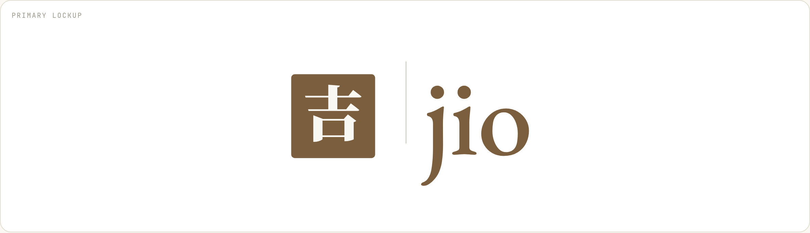
</p>

<h1 align="center">jiojio · Brand &amp; Design System</h1>

<p align="center">
  A quiet instrument for focused minds.<br>
  <sub>为专注的心,造一件安静的工具。</sub>
</p>

<p align="center">
  Warm paper, a single accent, three typefaces, no noise.<br>
  Brand guideline and design system for <strong>jiojio</strong>, shipped as one interactive HTML document.
</p>

---

## 一图看懂 · At a glance

Twelve tabs in four groups, read top to bottom: Brand sets direction, Foundations supplies the raw material, UI assembles it into components, UX keeps it usable. Every color and size flows through three token layers (bottom row), so one change reaches the logo and the buttons together.

十二个 tab 分四组:Brand 定方向,Foundations 给原料,UI 搭组件,UX 保体验。所有颜色和尺寸都经过三层令牌传递,改一处,logo 和按钮一起变。

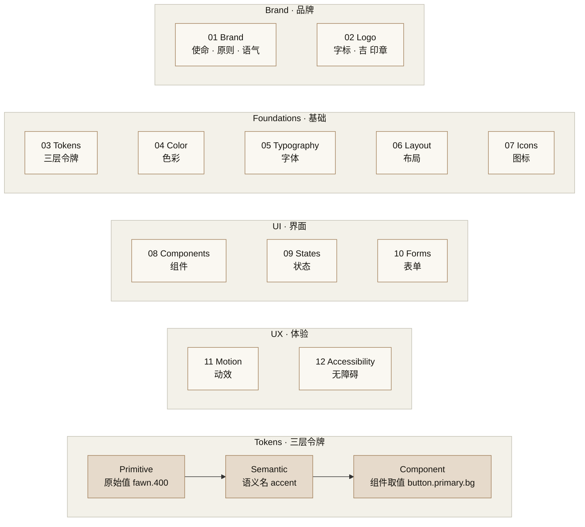

---

## Quick start · 快速开始

No build step, no npm. Clone and open.

```bash
git clone https://github.com/jiojio-lab/jiojio-brand-design.git
cd jiojio-brand-design
python3 -m http.server 8000     # then open http://localhost:8000
```

`index.html` is the design system. `logo-final.html` is the standalone logo spec.
Fonts come from Google Fonts and React from unpkg, so the first load needs a network connection.

---

## Design language · 设计语言

The whole system follows one idea: **remove the noise between a person and the thing they are trying to do.**
Everything below is a consequence of that.

整个系统只有一个出发点:**把人和他要做的事之间的噪音去掉。** 下面所有规则都是这个出发点的推论。

### Paper and Bark · 纸与树皮

The canvas is never pure white or pure black. Light mode sits on **Paper** `#FAF8F2`, a warm off-white; dark mode sits on **Bark** `#2D271C`, a warm brown-black. Surfaces step up one tier at a time from the canvas, and borders are hairlines that are visible but quiet.

底色不用纯白或纯黑。亮色模式是暖米色的 **Paper**,暗色模式是暖棕黑的 **Bark**。表面一层比一层亮一级,分割线细到刚好能看见。

### One accent, with a rule · 一个强调色,一条规则

The accent is **Fawn** `#A07E58`, a muted deer-hide brown. It is the only saturated color on the page, and it has a job: **Fawn means output or interaction** — primary buttons, selected states, focus rings, computed totals. **Ink** `#16140F` means **input or fact** — body copy, labels, values the user typed. Info, success, warning and danger exist, but they are tuned to the same lightness so none of them shout.

强调色是 **Fawn**(鹿皮棕),页面上唯一的饱和色,并且有明确分工:**Fawn = 输出与交互**,**Ink = 输入与事实**。四个语义色(信息 / 成功 / 警告 / 危险)调到同一亮度,谁也不抢戏。

### Three faces · 三副字体

| Role | Face | Why |
|---|---|---|
| Display | **Source Serif 4**, weight 300 | Light serif headlines read as calm rather than loud |
| UI | **DM Sans** | Neutral, compact, pairs with CJK without fighting it |
| Data | **JetBrains Mono** with `tnum` | Every number is tabular so columns align by default |
| Wordmark | **EB Garamond**, weight 500 | Only for the `jio` wordmark; never used for body text |

Chinese falls back to Noto Sans SC and Noto Serif SC. English and Chinese sit side by side everywhere in the system, English leading, Chinese as the quieter second line.

中英并排是系统的常态:英文在前,中文作为更安静的第二行。

### The logo · 标识

Two pieces. The wordmark `jio`, lowercase, set in EB Garamond. The seal 吉 on a rounded square. Both read their color from a single token, `--accent`, so changing the theme recolors the logo with no hand-syncing. The wordmark is the default; the seal is reserved for favicon, avatar and other small iconic contexts.

字标 `jio` 小写、EB Garamond;印章 **吉** 置于圆角方块。两者的颜色都绑在同一个 token 上,换主题时自动跟随。

<p align="center">
  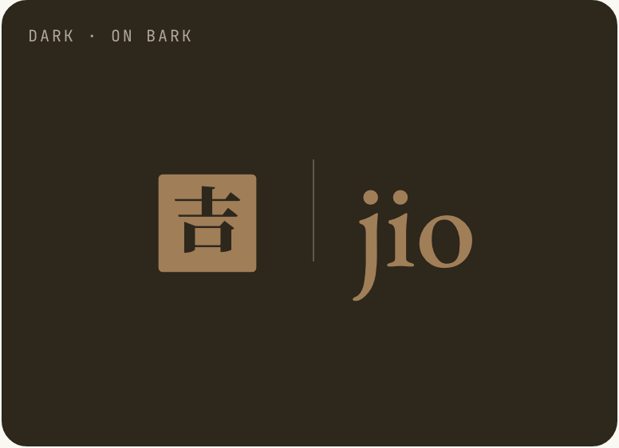
</p>

### Tokens first · 令牌优先

Colors, radii, shadows and type live in a three-layer token architecture: **primitive → semantic → component**. Components reach into the scale and never invent intermediate values. The Tokens tab exports the whole registry as W3C Design Tokens JSON or plain CSS variables.

颜色、圆角、投影、字体都走三层令牌:原始值 → 语义 → 组件。组件只取阶梯上的值,不自造中间值。

### What we refuse to do · 永远不做的事

- No emoji in product surfaces. 产品内不出现 emoji。
- No exclamation marks in UI copy. UI 文案不使用感叹号。
- No gradients on logo or typography. Logo 和排版不使用渐变。
- No drop shadow larger than 16px blur. 投影模糊半径不超过 16px。
- No more than three type weights per surface. 同一界面字重不超过三种。
- Never disable a button. Warn in red instead. 永不禁用按钮,用红色提示代替。

---

## Screenshots · 截图

**Brand** — mission, principles, voice. Light on Paper, dark on Bark.

<p align="center">
  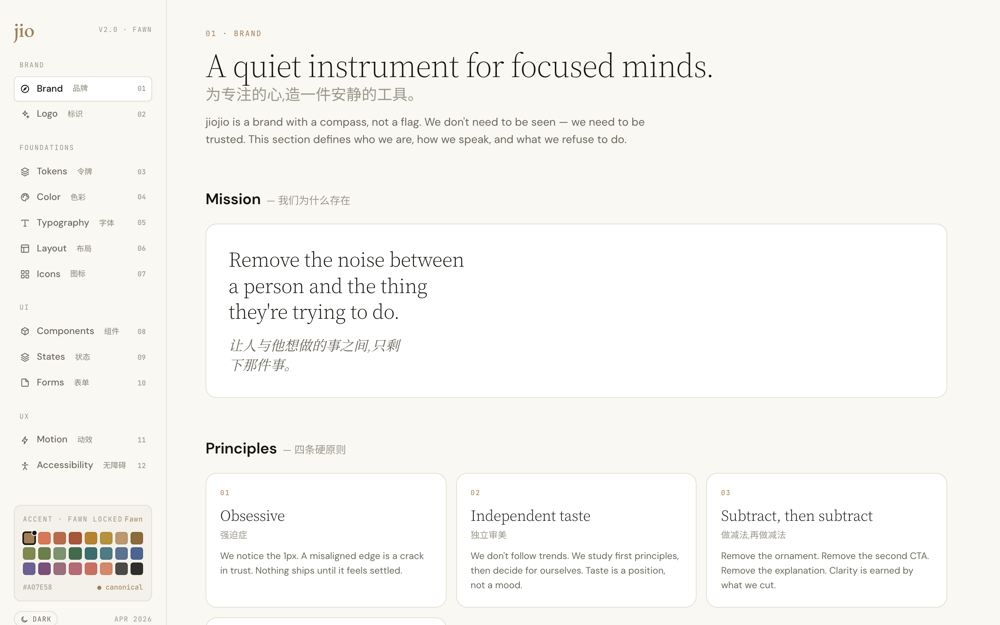
  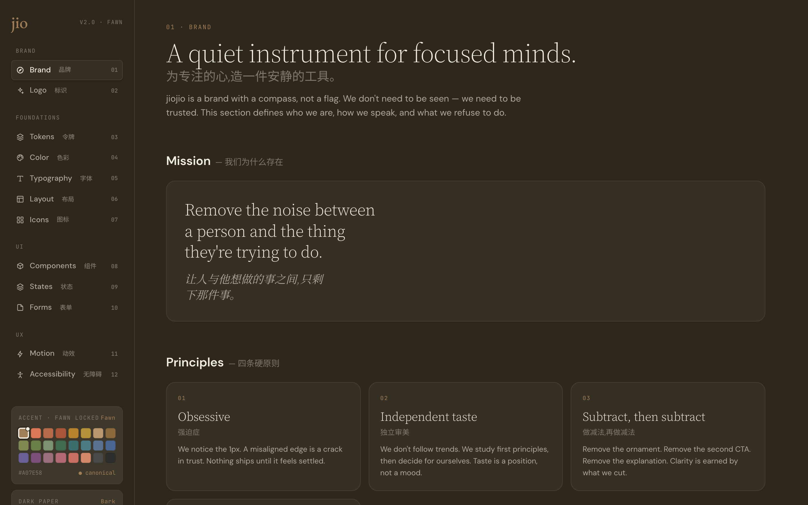
</p>

**Logo** — wordmark, seal, lockup, clear space, size ladder.

<p align="center">
  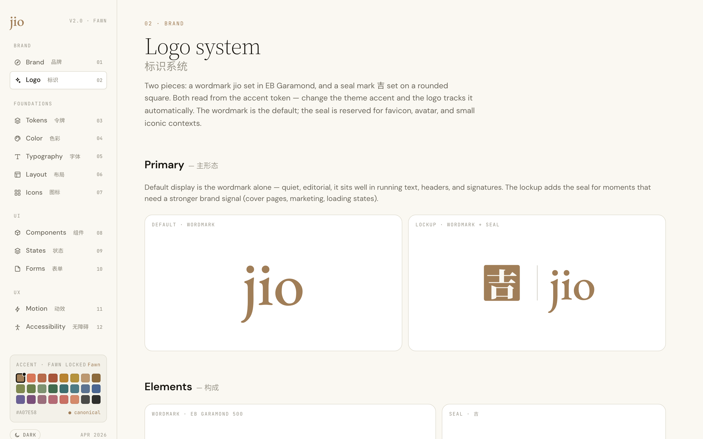
</p>

**Color** — Fawn 10-step scale, warm neutrals, semantic families, WCAG matrix.

<p align="center">
  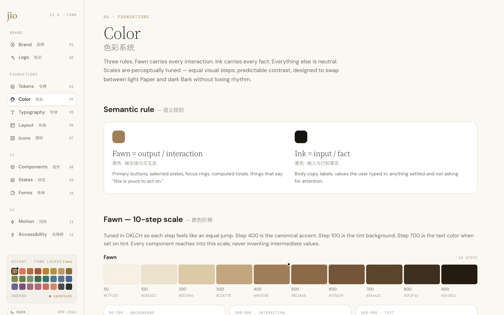
</p>

**Typography** — 16-step ramp, CN/EN mixing rules, OpenType features.

<p align="center">
  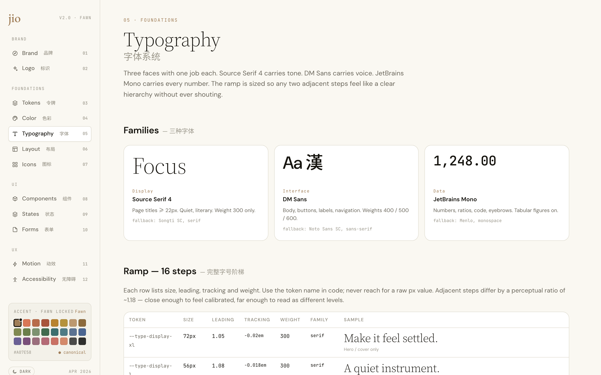
</p>

**Tokens** — three-layer architecture with live resolution and export.

<p align="center">
  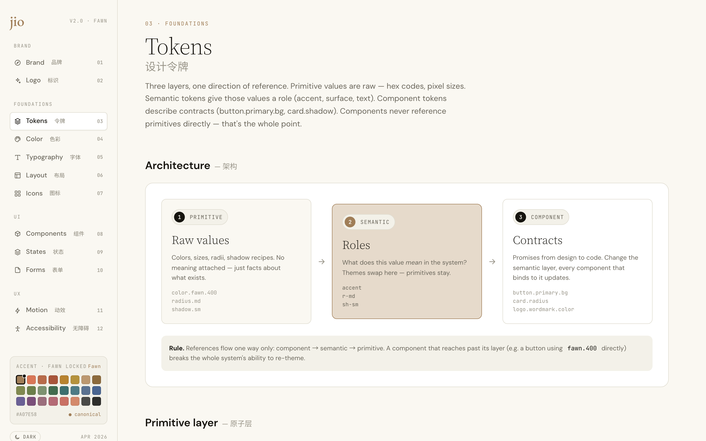
</p>

**Components and Forms** — every component is live. Hover, click, type.

<p align="center">
  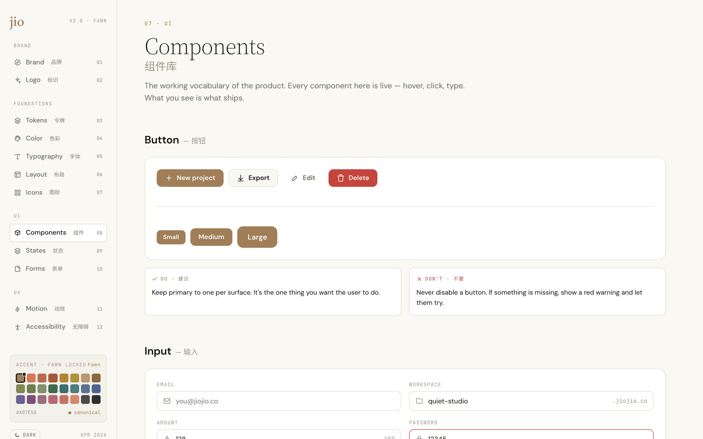
  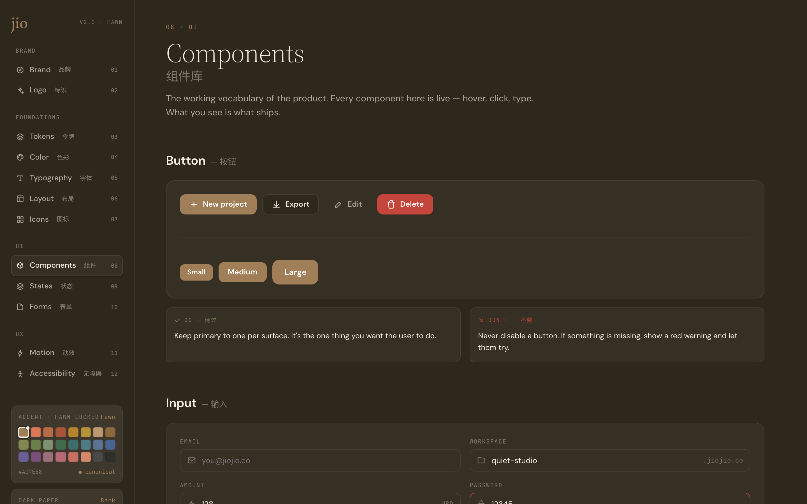
</p>
<p align="center">
  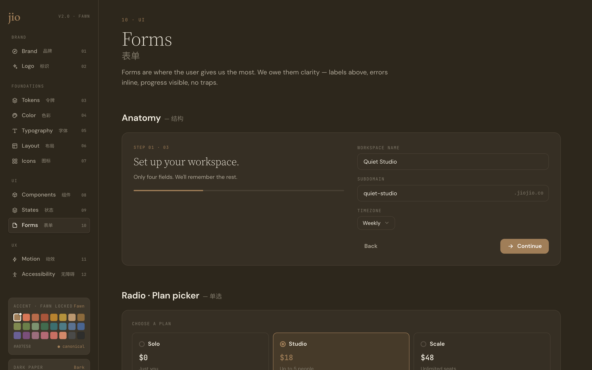
</p>

---

## What's inside · 内容

Twelve tabs in four groups, reachable from the left sidebar or by URL hash (`index.html#color`).

| # | Tab | Covers |
|---|---|---|
| 01 | Brand | Mission, four operating principles, five-axis voice scale, copy examples, non-negotiables |
| 02 | Logo | Wordmark, 吉 seal, lockup, clear space, size ladder, do / don't, color binding |
| 03 | Tokens | Primitive → semantic → component cascade, live registry, DTCG JSON + CSS vars export |
| 04 | Color | Fawn and Neutral 10-step OKLCH-tuned scales, semantic families, light/dark pairs, WCAG 2.2 matrix |
| 05 | Typography | Three faces, 16-step ramp with leading and tracking, CN/EN mixing, OpenType features, rhythm |
| 06 | Layout | Grid, breakpoints, container widths |
| 07 | Icons | Icon set, sizing, stroke rules |
| 08 | Components | Buttons, cards, inputs, tabs, badges, toasts |
| 09 | States | Empty, loading, error, success |
| 10 | Forms | Inputs, checkbox, radio, toggle, select, validation |
| 11 | Motion | Easing curves, duration scale, principles |
| 12 | Accessibility | WCAG matrix, keyboard paths, screen reader patterns |

### Theme controls

The sidebar has a light / dark toggle, a 24-swatch accent picker and, in dark mode, a six-paper dark canvas picker. Fawn and Bark are canonical; the rest exist to stress-test the system. Every change propagates live through the token chain, including the logo.

---

## Brand fundamentals · 品牌基础值

| | |
|---|---|
| **Wordmark** | `jio` · EB Garamond 500 · lowercase · `var(--accent)` |
| **Mark** | 吉 · Noto Serif SC · on a Fawn-Deep `#7A5E3E` rounded square |
| **Accent** | Fawn `#A07E58` (step 400 of the Fawn scale) |
| **Paper · light** | `#FAF8F2` |
| **Paper · dark** | Bark `#2D271C` |
| **Ink** | `#16140F` |
| **Type stack** | Source Serif 4 · DM Sans · JetBrains Mono |

---

## File map · 文件

```
index.html           entry point; CSS tokens for :root and [data-theme="dark"]
logo-final.html      standalone logo spec
src/
  app.jsx            sidebar nav, theme toggle, accent and dark-paper pickers
  shared.jsx         Icon, PageHeader, Section, Copyable, DoDontRow
  brand.jsx          01 Brand
  logo.jsx           02 Logo
  tokens.jsx         03 Tokens
  color.jsx          04 Color
  type.jsx           05 Typography
  layout.jsx         06 Layout
  icon.jsx           07 Icons
  components.jsx     08 Components
  states.jsx         09 States
  forms.jsx          10 Forms
  motion.jsx         11 Motion
  a11y.jsx           12 Accessibility
docs/screenshots/    images used in this README
```

React 18 and Babel Standalone are loaded from unpkg with pinned versions and integrity hashes. JSX is compiled in the browser, which is fine for a document and keeps the repo dependency-free.

---

## Status · 状态

Version 2.0 · Fawn. The system is a living document; edit the source files in place.

Release history lives in [`docs/releases/`](docs/releases/) (current: v2.0.0), and every change is logged in [`CHANGELOG.md`](CHANGELOG.md).

发布记录见 [`docs/releases/`](docs/releases/),变更清单见 [`CHANGELOG.md`](CHANGELOG.md)。

---

## License · 许可

Code and documentation are released under the [MIT License](LICENSE).
The jiojio name, the `jio` wordmark and the 吉 seal are brand assets and are not covered by the license.

代码与文档以 MIT 许可发布。jiojio 名称、`jio` 字标与 吉 印章属于品牌资产,不在许可范围内。
