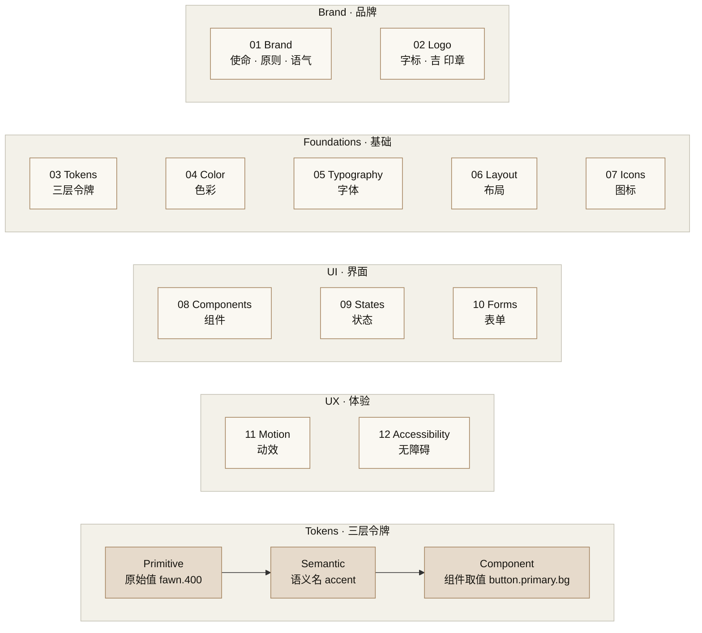

## 1. Verdict

**NOT MERGEABLE** — 3 项阻塞：验证命令声称无输出却实际命中，发布状态互相矛盾，数字与路径未满足等宽硬约束。

审查席位：GPT family。审查对象为用户指定的六份文件；README 仅审查新增 At a glance 和 Status 链接。工作树为 `release/v2.0.0`，HEAD `6f21d91f070146741fff306ca4082cdea02b4e98`，origin/main `633fe9c91b9bb9a7b08e0ba7d5229020cda58a51`。所有检查从指定工作树运行；未改动产品文件、未 stage、未 commit、未切分支。

## 2. Blocking findings

1. **验证结果不可复现：全仓 grep 并非“无输出”。**
   
   文件与原文：
   - `docs/releases/v2.0.0-release.html:240`：原文源码：`确定性：仓库内不再引用 <span class="mono">logo-lab-v6.html</span>。度量：<span class="mono">grep -rn logo-lab-v6 .</span> 无输出；点击返回落在 Logo tab。`。
   - 同文件 `:279`、`docs/releases/v2.0.0-brief-slide.html:352`：原文源码：`<li><span class="mono">grep -rn logo-lab-v6 .</span> 无输出</li>`。
   - `docs/releases/v2.0.0-release-notes.md:24`：“`grep -rn logo-lab-v6 .` 无输出。”
   
   证据：C05 实际运行该命令，在创建本 review 之前就输出 **8 个匹配行**，包括：
   ```text
   ./docs/releases/v2.0.0-release-notes.md:24:- `grep -rn logo-lab-v6 .` 无输出。
   ./docs/releases/v2.0.0-brief-slide.html:352:          <li><span class="mono">grep -rn logo-lab-v6 .</span> 无输出</li>
   ```
   正确结论：运行时链接已修正（C06 显示 `href="logo-lab-v6.html"` 改成 `href="index.html#logo"`），但历史说明与验证命令本身仍含旧文件名。应针对运行时 HTML 的链接属性验证，或明确排除发布说明；不可宣称全仓无引用。
   
   为什么阻塞：验证章节给出一个在本次发布包上必然失败的验收结果，违反真实性要求。

2. **同一版本同时标为“已发布”和“待发布”，且“已合并”范围不清。**
   
   文件与原文：
   - `docs/releases/README.md:39`：“| v2.0.0 | 2026-10-05 | 已发布（tag 待回填） |”。
   - `docs/releases/v2.0.0-release-notes.md:5`：“状态：已合并待发布。tag SHA：待回填。源码 zip SHA-256：待回填。”
   - `docs/releases/v2.0.0-release.html:126`：“状态：已合并待发布（tag 与源码 zip 校验值待回填）”。
   - `docs/releases/v2.0.0-brief-slide.html:169`：同样写“状态：已合并待发布”。
   
   证据：C10 原样列出了上述互相冲突的状态。C05：
   ```text
   25e841fd32f58c224355fd612f62877d7c91545c refs/tags/v2.0.0
   ancestor_exit=1
   ```
   C07 的 `git cat-file -p v2.0.0`：
   ```text
   object 633fe9c91b9bb9a7b08e0ba7d5229020cda58a51
   type commit
   tag v2.0.0
   ```
   正确的本地事实：PR #1 已合入 `633fe9c`；发布包 HEAD 尚非 origin/main 的祖先；本地 v2.0.0 tag 已存在且指向 `633fe9c`。本地 tag 不足以证明 GitHub Release 已发布，本次未调用远端 Release API，不能断言远端是否发布。四处必须使用同一个经确认的状态，并区分 PR #1 与发布包 PR。
   
   为什么阻塞：版本索引是读者判断是否已发布的入口，不能与其链接的三份发布物相互矛盾。

3. **违反“数字、路径使用等宽字体”的硬约束。**
   
   文件与精确源码：
   - `docs/releases/v2.0.0-release.html:115` 和 `docs/releases/v2.0.0-brief-slide.html:145`：`<b>v2.0.0</b>`。
   - `docs/releases/v2.0.0-release.html:185`：`<td>Brand 2 + Foundations 5 + UI 3 + UX 2 = 12 个 tab；侧栏、亮暗主题、24 色强调色挑选器</td>`。
   - `docs/releases/v2.0.0-brief-slide.html:260`：`<h2>为什么是现在：仓库在 2026-10-05 从私有转为公开</h2>`。
   - `docs/releases/v2.0.0-brief-slide.html:339`：`<p class="footnote">其余各项同格式四问详解，见 release 页面（v2.0.0-release.html）。</p>`。
   
   证据：C04/C06 显示两个 HTML 的默认字体是 `font-family: var(--sans)`；`.crumb b` 只设置颜色和字重，`h2`、`table.plain td`、`.footnote` 均没有等宽覆盖。上述节点没有 `.mono` 或等宽祖先。C13 静态扫描还列出大量同类位置，例如 release.html:154 的“下 14 个 jsx，合计 3,928 行）”、brief-slide.html:312 的“12 个 tab、4 组；合计 3,928 行”以及正文中裸露的 `logo-final.html`。
   
   正确值/修复：数字、日期、版本和路径应包入既有 `.mono`，或由相应组件 CSS 明确设置等宽；必要时连同 `tnum` 一起覆盖。C13 是源码继承检查，不冒充浏览器 computed-style 测试；品牌名 W3C 等含数字的词是候选项，不据此单独判错。
   
   为什么阻塞：这是任务指定的硬样式门槛，且项目 `docs/releases/README.md:30` 自己也承诺“数字、路径、版本号一律等宽加 tnum”。

## 3. Non-blocking findings

1. **把“noreply 地址”扩大成了“全部 GitHub noreply 地址”。**
   
   文件与原文：`docs/releases/v2.0.0-brief-slide.html:251`：“GitHub 提供的替身邮箱 … 本版：全史作者邮箱都改成了它。”；同文件 `:331`：“全史作者与提交者邮箱：…@users.noreply.github.com”。
   
   证据（C05，实际执行 `git log --format='%ae%n%ce' | sort -u`）：
   ```text
   16084282+wd2es7@users.noreply.github.com
   noreply@anthropic.com
   noreply@github.com
   ```
   C15 还显示 `a729106`、`7235ea2`、`0cd12f9` 的作者和提交者都是 Anthropic noreply，因此问题并非仅由发布包新 commit 引入。
   
   正确表述：当前可达 commit 的作者/提交者邮箱均为 noreply 地址，域名包括 GitHub 与 Anthropic。两个早期作者改为 GitHub noreply 与“所有作者都改为 GitHub noreply”是不同命题。非阻塞原因：没有发现个人 Gmail 回流，修正文案即可。

2. **“所有颜色与尺寸都经过三层令牌”超过实现保证。**
   
   文件与原文：
   - `README.md:21`：“Every color and size flows through three token layers (bottom row), so one change reaches the logo and the buttons together.”
   - `README.md:23`：“所有颜色和尺寸都经过三层令牌传递”。
   - `docs/releases/v2.0.0-brief-slide.html:178`：“所有颜色与尺寸都从「原始值 → 语义名 → 组件取值」三层往下传”。
   
   证据（C15）：
   ```text
   6:    sm: { padding: "6px 12px", fontSize: 12.5, radius: 8, iconSize: 14 },
   7:    md: { padding: "9px 16px", fontSize: 13.5, radius: 10, iconSize: 16 },
   11:    primary:   { bg: "var(--accent)", fg: "#fff", bd: "var(--accent)" },
   ```
   正确表述：系统提供三层 token 架构，强调色等共享值可联动；实际组件仍有直接写入的尺寸和颜色。非阻塞原因：图的架构方向与主题联动仍有源码支持，删去全称量词即可，无需本次重构组件。

3. **若干历史数字、时间点及“已经验证”声明缺少可复核记录，应标记来源或待核实。**
   
   文件与原文：
   - `docs/releases/v2.0.0-release.html:190`：“2 个早期 commit 的作者邮箱是个人 Gmail”。
   - `docs/releases/v2.0.0-brief-slide.html:260`：“仓库在 2026-10-05 从私有转为公开”。
   - `CHANGELOG.md:29`：“转 public 前的隐私审计（逐文件加全历史扫描，无密钥、路径、真人信息）”。
   - `docs/releases/v2.0.0-release-notes.md:25`：“发布物页面经无头 Chrome 逐页截图查验；两个 HTML 单独拷到空目录打开，无裂图、无外链请求。”
   
   证据边界：C00 的 git log 只有重写后的 commit 和 commit 日期；C15 邮箱已全部是 noreply，无法反推出原始个人邮箱 commit 的数量。C08 的工作树文件清单仅有产品截图、源码、发布文档与模板，没有上述历史审计日志或此次发布 HTML 截图记录。没有执行 visibility audit API，没有原始 SHA/重写映射，无法核实公开发生的具体日期、“公开前”顺序、“两次/一次”历史处置次数、账号邮箱隐私开关或旧 SHA 缓存状态。C12 显示工作树模块查找中 Mermaid/Playwright/Puppeteer 均未安装；本 review 未执行截图或隔离目录打开，以遵守只允许写一份文件的边界。
   
   正确处理：为这些过去发生的事件补证据指针/执行者记录；无法补证据的标为“据维护者记录，未在本次复核”，未来验收改成计划语态。**这是未证实项，不是判定捏造；不猜测正确历史数量或日期。** 非阻塞原因：当前 repo 能核实的结果已另行核实，缺失的是历史过程证明。

4. **“本版变更”与统计终点的范围未在各文档统一。**
   
   文件与原文：
   - `CHANGELOG.md:16`：“发布物：`docs/releases/`（版本流程、模板、v2.0.0 三件套）、本 CHANGELOG、README 的「一图看懂」Mermaid 图。”
   - `docs/releases/v2.0.0-brief-slide.html:308`：“6 项变更：空仓库（README 一行）→ v2.0.0”；其总表只有 F1–F6。
   - `docs/releases/v2.0.0-release-notes.md:6`：“`git diff --stat 152069e 633fe9c` = `29 files changed, 4164 insertions(+), 1 deletion(-)`。”
   - `docs/releases/v2.0.0-release.html:147` 已明确：原文源码：`发布物 PR 追加的 <span class="mono">docs/releases/</span>、<span class="mono">CHANGELOG.md</span>、README 「一图看懂」不在 633fe9c 之内。`
   
   证据（C07）：`git diff --shortstat 152069e HEAD` 实际为：
   ```text
    36 files changed, 5663 insertions(+), 1 deletion(-)
   ```
   `git diff --name-only 633fe9c HEAD` 确认新增发布包、模板、CHANGELOG 以及 README 改动。正确结论：**29/+4164/−1 是截至 633fe9c 的正确数字，不是算错**；36/+5663/−1 才是当前审查 HEAD 的范围。应在 notes/brief 与 CHANGELOG 统一标注“产品基线截至 633fe9c；发布文档另计”，并列出文档包这一类变更。
   
   非阻塞原因：release.html 已披露边界，F1–F6 的实际变更在三份文档及 CHANGELOG 中一致；问题是其余入口没有相同的范围说明，不能偷偷把已有正确统计判错。

## 4. Commands run with outputs

以下命令均在 `/Users/purin/Projects/jiojio-brand-design-release` 执行。输出为原样摘录；“[trimmed]”表示省略，与空输出严格区分。C 编号对应下方执行记录。

核对结论：
- 所有列出的 commit SHA 均存在；日期分别为 152069e=2026-04-26、2d50f27=2026-04-27、0cd12f9/7235ea2/a729106/633fe9c=2026-10-05。PR #1、merge 的两个父节点、保留 3 个分支 commit 均吻合。
- 三组 diff 数值全部吻合：152069e→2d50f27 为 17/+4034/−1；2d50f27→633fe9c 为 21/+206/−76；152069e→633fe9c 为 29/+4164/−1。
- 14 个 JSX、12 个 tab、4 组（2/5/3/2）、24 个 accent、11 张截图、LICENSE 21 行、本体 3,928 行、7 个页头修复（06–12）、1 处返回链接修复、6 项 F 变更、6 条禁令、3 层 token、9 段 release / 9 页 brief 均吻合。数字 16px 和最多 3 种字重与源码禁令吻合；系统 footer 为 2.0.0，React 来源为 18.3.1，符合 React 18 表述。字体 500 和色值属于设计规范，源码/文档没有查到此次修改造成的矛盾。
- 初始 README 的内容是 `# jiojio-brand-design`，逻辑上一行但无末尾换行，故 `wc -l` 是 0；不应据此报告“一行”有误。**未发现可证实的错误算术数字；未能复核的历史数字见非阻塞 3。**
- 两 HTML 的 http(s) grep 无匹配，没有加载外部字体、脚本、CSS 的标签；唯一图形为内联 SVG。Markdown 中链接为导航链接，不是外部资源加载。Unicode 候选扫描和源码阅读未见 emoji；箭头/分隔标点及“吉”品牌 tile 不误报为 emoji。
- 评审均明确 pending，未发现宣称评审已通过或部署完成的句子。使用数据未预支；T+1~2w、T+1~3m 属未来验证窗口，不作为已发生数字。
- Mermaid 静态检查：合法的 flowchart TB、quoted labels、subgraph/direction/end、~~~ 与 -->、classDef/class/style；无初始化或不支持的配置指令；5 个 subgraph 与 5 个 end 配对、12 个 tab 节点与 TABS 对应。**未运行 Mermaid parser 或 GitHub 渲染，不能声称渲染验证已通过。** Status 的两个目标均存在。
- 按要求在创建本报告前对整个工作树（排除 .git）扫描两条隐私关键词，均 exit 1、stdout/stderr 空；未发现目标个人 Gmail 或旧个人仓库 URL。本报告的命令记录会包含搜索表达式；之后重复全仓扫描应区分本审计日志与被审查发布内容。

**初始环境检查**

``````sh
pwd; git status --short; git branch --show-current; git rev-parse HEAD origin/main; rg --files -g AGENTS.md -g '*DESIGN*' -g '*review*' .
``````

``````text
/Users/purin/Projects/jiojio-brand-design-release
release/v2.0.0
6f21d91f070146741fff306ca4082cdea02b4e98
633fe9c91b9bb9a7b08e0ba7d5229020cda58a51
``````

状态输出为空；最后的文件名检索无匹配，整条命令 exit 1。

``````sh
cat docs/releases/v2.0.0-release.html docs/releases/v2.0.0-brief-slide.html docs/releases/v2.0.0-release-notes.md CHANGELOG.md README.md docs/releases/README.md
``````

``````text
<!doctype html>
<html lang="zh-CN">
[trimmed; 全文读取被截断，以下定向补读]
``````

**C00**

``````sh
git log --all --date=iso-strict --format='%h %ad %s'; git tag --list; git diff --stat 152069e 633fe9c; git diff --stat 2d50f27 633fe9c; git diff --stat 152069e 2d50f27
``````

``````text
[trimmed]
6f21d91 2026-10-05T21:56:42+09:00 docs(release): v2.0.0 release pack (release page, brief slide, notes, CHANGELOG, README at-a-glance)
633fe9c 2026-10-05T21:40:17+09:00 Merge pull request #1 from jiojio-lab/readme-public
a729106 2026-10-05T21:39:36+09:00 chore: add MIT license; README license section reserves brand assets
7235ea2 2026-10-05T21:33:05+09:00 docs: put Chinese summaries in their own paragraphs
0cd12f9 2026-10-05T21:32:16+09:00 docs: public-facing README with screenshots and design-language summary
2d50f27 2026-04-27T09:54:48Z Update brand design files
152069e 2026-04-26T22:04:56+09:00 Initial commit
v2.0.0
 29 files changed, 4164 insertions(+), 1 deletion(-)
 21 files changed, 206 insertions(+), 76 deletions(-)
 17 files changed, 4034 insertions(+), 1 deletion(-)
``````

**C01**

``````sh
ls src; wc -l index.html logo-final.html src/*.jsx LICENSE; ls docs/screenshots; grep -c ' window.BrandTab(),    num: "01" },
  { key: "logo",      label: "Logo",       sub: "标识", group: "Brand",       Comp: () => window.LogoTab(),     num: "02" },
  { key: "tokens",    label: "Tokens",     sub: "令牌", group: "Foundations", Comp: () => window.TokensTab(),   num: "03" },
  { key: "color",     label: "Color",      sub: "色彩", group: "Foundations", Comp: () => window.ColorTab(),    num: "04" },
  { key: "type",      label: "Typography", sub: "字体", group: "Foundations", Comp: () => window.TypeTab(),     num: "05" },
  { key: "layout",    label: "Layout",     sub: "布局", group: "Foundations", Comp: () => window.LayoutTab(),   num: "06" },
  { key: "icon",      label: "Icons",      sub: "图标", group: "Foundations", Comp: () => window.IconTab(),     num: "07" },
  { key: "components",label: "Components", sub: "组件", group: "UI",          Comp: () => window.ComponentsTab(),num: "08" },
  { key: "states",    label: "States",     sub: "状态", group: "UI",          Comp: () => window.StatesTab(),   num: "09" },
  { key: "forms",     label: "Forms",      sub: "表单", group: "UI",          Comp: () => window.FormsTab(),    num: "10" },
  { key: "motion",    label: "Motion",     sub: "动效", group: "UX",          Comp: () => window.MotionTab(),   num: "11" },
  { key: "a11y",      label: "Accessibility", sub: "无障碍", group: "UX",     Comp: () => window.A11yTab(),     num: "12" },
];

const NavIcon = ({ k }) => {
  const map = { brand: "compass", logo: "sparkles", tokens: "layers", color: "palette", type: "type", layout: "layout", icon: "grid", components: "cube", states: "layers", forms: "file", motion: "zap", a11y: "accessibility" };
  return <Icon name={map[k] || "file"} size={14} stroke="currentColor"/>;
};
[trimmed]
``````

**C02**

``````sh
nl -ba docs/releases/v2.0.0-release.html | sed -n '245,420p'; cat docs/releases/v2.0.0-release-notes.md
``````

``````text
[trimmed]
   247	        <div><span class="q">修了什么</span>新增 <span class="mono">LICENSE</span>（MIT，21 行）；README 增加 License 节，明确写出 jiojio 名称、<span class="mono">jio</span> 字标、「吉」印章是品牌资产，不在许可范围内。</div>
   257	        <div><span class="q">修了什么</span>转 public 前做了逐文件加全历史的扫描：没有密钥、本机路径、真人信息，但发现两处。一是两个早期 commit 的作者邮箱是个人 Gmail，用 <span class="mono">git filter-repo --mailmap</span> 全史改为 GitHub noreply 地址；二是旧 README 里指向个人账号的 clone URL，用 <span class="mono">--replace-text</span> 在历史中替换为组织地址。随后 force push。</div>
   258	        <div><span class="q">为什么这样修</span>邮箱写在 commit 对象里，仓库一公开，任何人 clone 后 <span class="mono">git log</span> 即可读到，公开后再删文件也删不掉历史。唯一办法是在公开前重写。</div>
   260	        <div class="delta"><span class="q">delta</span>确定性：历史里的作者与提交者邮箱只剩 noreply 地址。度量：<span class="mono">git log --format='%ae%n%ce' | sort -u</span> 只含 noreply 域名。<b>遗留两项（见 08 段）：</b>重写前的旧 SHA 仍可经 GitHub 按 URL 直接访问，需向 GitHub support 申请清除；账号未开启邮箱隐私，GitHub 服务端生成的 merge commit 会再次带出邮箱（已发生一次并已重写修掉）。</div>
   268	      <div class="card"><h3>流程</h3><p>设计系统本体直接入 main（2d50f27）；收口工作走分支 <span class="mono">readme-public</span> 与 PR #1，以 merge commit 633fe9c 合入，不 squash，保留 3 个 commit 的完整历史。转 public 前做过一次逐文件加全历史的隐私扫描（结论：无密钥、路径、真人信息，发现的两项见 F6）。本发布物在分支 <span class="mono">release/v2.0.0</span> 上写成，页内数字逐一用 <span class="mono">git log</span> / <span class="mono">git diff --stat</span> / <span class="mono">wc -l</span> 核对，页面用无头 Chrome 截图查验。</p></div>
   269	      <div class="card"><h3>评审结论</h3><p>cross-model 评审：<span class="badge warn">pending</span> 总工程师回填。回填内容包括评审席位、verdict、原文落盘路径与修订落地情况。<br/><br/>评审范围说明：本版的评审对象是发布物与隐私处置；F1 设计系统的设计内容本身（4 月原样入库）不在本次评审范围内。</p></div>
   277	        <li>clone 后起本地服务，逐个打开 <span class="mono">#brand</span> 到 <span class="mono">#a11y</span> 共 12 个 hash，页头 kicker 与侧栏编号一致</li>
   278	        <li><span class="mono">git log --format='%ae%n%ce' | sort -u</span> 只含 noreply</li>
   279	        <li><span class="mono">grep -rn logo-lab-v6 .</span> 无输出</li>
   298	      <li><b>向 GitHub support 申请清除旧 SHA 缓存：</b>重写前的 commit SHA 仍能按 URL 访问，里面是旧邮箱与旧 URL。只有 jiojio 能以账号所有者身份提交申请。</li>
   299	      <li><b>开启账号设置「Keep my email addresses private」：</b>不开则 GitHub 服务端生成的 merge commit 会再次写入个人邮箱，每次都要再重写一次历史。</li>
   300	      <li><b>React development 版换 production 版：</b><span class="mono">index.html</span> 目前加载 <span class="mono">react.development.js</span>，体积大且带开发警告。换版需要同步更换 SRI 哈希，属于 index.html 的功能性改动，留给下一版。</li>
   301	      <li><b>logo-final.html 与主系统 logo 色值不一致：</b>logo-final.html 写默认 <span class="mono">--accent = #7A5E3E</span>（Fawn Deep），主系统 <span class="mono">--accent = #A07E58</span>（Fawn）且 Logo tab 说明 logo 取该 token。需要 jiojio 定稿以哪个为准，再统一一边。</li>
   315	        <li>152069e  2026-04-26  Initial commit</li>
   316	        <li>2d50f27  2026-04-27  Update brand design files</li>
   317	        <li>0cd12f9  2026-10-05  public-facing README</li>
   318	        <li>7235ea2  2026-10-05  中文摘要独立成段</li>
   319	        <li>a729106  2026-10-05  add MIT license</li>
   320	        <li>633fe9c  2026-10-05  Merge pull request #1</li>
## jiojio-brand-design v2.0.0

jiojio 品牌指南与设计系统的首个 release。设计系统本体（12 个 tab，单页交互 HTML，React 18 + Babel Standalone 由 unpkg 加载，无构建）加上 2026-10-05 转为 public 时的一轮收口：公开版 README、页头编号修正、死链修正、MIT 许可，以及一次为清除个人邮箱而做的全史重写。

- 状态：已合并待发布。tag SHA：待回填。源码 zip SHA-256：待回填。
- 对比基线：无 baseline tag，以 Initial commit `152069e` 为基线；`git diff --stat 152069e 633fe9c` = `29 files changed, 4164 insertions(+), 1 deletion(-)`。
- 许可：MIT;jiojio 名称、`jio` 字标、吉 印章为品牌资产，不在许可内。

### 变更

| # | 变更项 | Before | After |
|---|---|---|---|
| F1 | 设计系统本体 | 仓库只有 README 一行 | 12 个 tab、4 组（Brand 2 / Foundations 5 / UI 3 / UX 2）；设计系统文件合计 3,928 行 |
| F2 | 公开版 README | 内部口径，无截图 | 中英设计语言、11 张截图、tab 索引、文件地图 |
| F3 | 页头编号与分组 | 7 个页面与侧栏不一致 | 12 个页头与侧栏逐一对应 |
| F4 | logo-final.html 死链 | 指向不存在的 `logo-lab-v6.html` | 指向 `index.html#logo` |
| F5 | MIT 许可 | 无 LICENSE | MIT，品牌资产保留 |
| F6 | 历史重写（隐私） | 历史含个人邮箱与个人账号 URL | 全史只含 noreply 邮箱与组织地址 |

### 验证

- 本地起服务（`python3 -m http.server 8000`），逐个打开 `index.html#brand` 到 `#a11y` 共 12 个页面，页头编号与侧栏一致。
- `git log --format='%ae%n%ce' | sort -u` 只含 noreply 地址。
- `grep -rn logo-lab-v6 .` 无输出。
- 发布物页面经无头 Chrome 逐页截图查验；两个 HTML 单独拷到空目录打开，无裂图、无外链请求。

### 评审

cross-model 评审：pending，总工程师回填。

### 遗留与决策点

- 向 GitHub support 申请清除重写前的旧 commit SHA（只有账号所有者能提交）。
- 开启账号设置「Keep my email addresses private」，否则 GitHub 服务端生成的 merge commit 会再次带出邮箱。
- `index.html` 加载的是 React development 版，换 production 版需同步更换 SRI 哈希。
- `logo-final.html` 写默认 `--accent = #7A5E3E`，主系统 `--accent = #A07E58`，待 jiojio 定稿以哪个为准。
- 首次打开需要联网（Google Fonts、unpkg）。

### 回滚

静态文档仓库，无部署；回滚 = checkout 上一 tag 或 `git revert`。本版是首个 tag，没有上一 tag 可回，回滚只能靠 `git revert`。

### 发布记录（待回填）

- tag:`v2.0.0`,SHA：待回填
- 源码 zip:`jiojio-brand-design-v2.0.0.zip`,SHA-256：待回填
- 评审原文落盘路径：待回填

### 发布物

- `v2.0.0-release.html`：九段完整账目
- `v2.0.0-brief-slide.html`：给第一次接触本项目的人的简报
- 源码 zip

完整 diff 与追溯见 [CHANGELOG.md](https://github.com/jiojio-lab/jiojio-brand-design/blob/main/CHANGELOG.md)。
``````

**C03**

``````sh
nl -ba docs/releases/v2.0.0-brief-slide.html | sed -n '160,450p'
``````

``````text
[trimmed]
   169	      <div class="statusline">状态：已合并待发布（tag 与源码 zip 校验值待回填）。本版没有部署对象，不预支任何使用数据</div>
   177	      <h2>设计系统是什么：4 组 12 个 tab，加三层令牌</h2>
   178	      <p class="lede">左边是内容：品牌、基础、界面、体验四组共 12 个 tab，在同一页的侧栏里切换。右边是机制：所有颜色与尺寸都从「原始值 → 语义名 → 组件取值」三层往下传，换一个主题色，logo 和按钮一起变。</p>
   246	        <div class="card"><dt>Fawn 与 Ink <span class="en">accent rule</span></dt><dd>Fawn <span class="mono">#A07E58</span> 是唯一强调色，表示输出与交互；Ink <span class="mono">#16140F</span> 表示输入与事实。<b>本版：</b>logo 色值对不上它（见决策点）。</dd></div>
   249	        <div class="card"><dt>MIT 许可 <span class="en">MIT License</span></dt><dd>最宽松的开源许可之一：可以复制、修改、再分发，只需保留版权声明。<b>本版：</b>新增，代码与文档适用，品牌资产除外。</dd></div>
   250	        <div class="card"><dt>历史重写 <span class="en">git filter-repo</span></dt><dd>改写仓库里每一个已有 commit，所有 commit 编号随之改变。<b>本版：</b>用它清除了历史中的个人邮箱与个人账号地址。</dd></div>
   251	        <div class="card"><dt>noreply 邮箱 <span class="en">GitHub noreply address</span></dt><dd>GitHub 提供的替身邮箱，commit 里写它，真实邮箱就不会公开。<b>本版：</b>全史作者邮箱都改成了它。</dd></div>
   260	      <h2>为什么是现在：仓库在 2026-10-05 从私有转为公开</h2>
   264	          <li>2 个早期 commit 的作者邮箱是个人 Gmail</li>
   266	          <li>7 个页面的页头编号与侧栏不一致</li>
   267	          <li>logo 规范页有 1 处死链</li>
   308	      <h2>6 项变更：空仓库（README 一行）→ v2.0.0</h2>
   312	          <tr><td class="mono">F1</td><td><b>设计系统本体</b></td><td>仓库只有 README 一行</td><td>12 个 tab、4 组；合计 3,928 行</td></tr>
   313	          <tr><td class="mono">F2</td><td><b>公开版 README</b></td><td>内部口径，无截图</td><td>中英设计语言、11 张截图、tab 索引</td></tr>
   314	          <tr><td class="mono">F3</td><td><b>页头编号修正</b></td><td>7 页页头与侧栏不一致（例：Components 写 07，侧栏是 08）</td><td>12 页页头与侧栏逐一对应</td></tr>
   315	          <tr><td class="mono">F4</td><td><b>logo 页死链</b></td><td>返回链接指向不存在的页面</td><td>返回 <code class="mono">index.html#logo</code></td></tr>
   316	          <tr><td class="mono">F5</td><td><b>MIT 许可</b></td><td>无 LICENSE</td><td>MIT；名称、字标、印章为品牌资产不在内</td></tr>
   317	          <tr><td class="mono">F6</td><td><b>历史重写</b></td><td>历史含个人邮箱与个人账号 URL</td><td>全史只含 noreply 邮箱与组织地址</td></tr>
   320	      <p class="footnote">质量保障：收口走 PR #1（merge commit 633fe9c，不 squash）；转公开前做过逐文件加全历史的隐私扫描；本发布物的数字全部用 git 命令核对。cross-model 评审 pending，总工程师回填。</p>
   330	        <div class="before"><span class="label">Before</span>2 个早期 commit 的作者邮箱：<code>个人 Gmail</code><br/>旧 README 的 clone URL：<code>github.com/个人账号/…</code></div>
   331	        <div class="after"><span class="label">After</span>全史作者与提交者邮箱：<code>…@users.noreply.github.com</code><br/>clone URL：<code>github.com/jiojio-lab/jiojio-brand-design</code></div>
   337	        <div class="card ok"><h3><span class="num">4</span>delta 在哪</h3><p><b>确定性：</b>历史里不再出现个人邮箱。<b>度量：</b><code class="mono">git log --format='%ae%n%ce' | sort -u</code> 只含 noreply。<b>遗留：</b>旧 SHA 仍可按 URL 访问，等 GitHub support 清除。</p></div>
   339	      <p class="footnote">其余各项同格式四问详解，见 release 页面（v2.0.0-release.html）。</p>
   350	          <li>本地起服务，逐个打开 <span class="mono">#brand</span> 到 <span class="mono">#a11y</span> 12 个页面，页头编号与侧栏一致</li>
   351	          <li><span class="mono">git log --format='%ae%n%ce' | sort -u</span> 只含 noreply</li>
   352	          <li><span class="mono">grep -rn logo-lab-v6 .</span> 无输出</li>
   361	          <li>logo 色值定稿后，logo-final.html 与主系统一致</li>
   379	          <li>logo 色值以哪个为准：<span class="mono">#7A5E3E</span>（logo-final.html）还是 <span class="mono">#A07E58</span>（主系统）</li>
   387	      <div class="card accent" style="margin-top:14px"><h3>一句话总结</h3><p style="font-size:14px">v2.0.0 是 jiojio 设计系统的<b>首个公开版本</b>：12 个 tab 的本体原样入库，收口补齐了<b>公开 README、页头编号、死链、MIT 许可</b>，并在公开前<b>重写历史清除了个人邮箱</b>；还有两件只有 jiojio 能做的事（清缓存、开邮箱隐私）待办。</p></div>
   388	      <p class="footnote mono">追溯：github.com/jiojio-lab/jiojio-brand-design · 152069e..633fe9c · PR #1 · docs/releases/v2.0.0-release.html · CHANGELOG.md</p>
   394	<script>
   427	  function goHash() {
   433	  window.addEventListener('hashchange', goHash);
``````

**C04**

``````sh
nl -ba docs/releases/v2.0.0-release.html | sed -n '214,244p'; nl -ba docs/releases/v2.0.0-brief-slide.html | sed -n '1,177p'
``````

``````text
[trimmed]
   220	      <div class="fix-head"><span class="fno">F3</span><b>页头编号与分组修正（7 页）</b><span class="loc">src/{layout,icon,components,states,forms,motion,a11y}.jsx</span></div>
   222	        <div><span class="q">修了什么</span>7 个页面的 <span class="mono">kicker</span> 改成与侧栏一致：<br/>
   223	          Layout <span class="mono">05 · UI → 06 · Foundations</span><br/>
   224	          Icons <span class="mono">06 · UI → 07 · Foundations</span><br/>
   225	          Components <span class="mono">07 → 08</span> · States <span class="mono">08 → 09</span> · Forms <span class="mono">09 → 10</span><br/>
   226	          Motion <span class="mono">10 · Motion → 11 · UX</span><br/>
   227	          Accessibility <span class="mono">11 → 12</span></div>
   230	        <div class="delta"><span class="q">delta</span>确定性：12 个页头 kicker 与 TABS 的 num 和 group 一一对应（01 到 05 本来就对）。度量：<span class="mono">grep -n 'kicker=' src/*.jsx</span> 与 TABS 逐行对照。</div>
   237	        <div><span class="q">修了什么</span>页首的返回链接从 <span class="mono">logo-lab-v6.html</span>（仓库里不存在）改为 <span class="mono">index.html#logo</span>，文案从「back to lab」改为「back to design system」。</div>
   240	        <div class="delta"><span class="q">delta</span>确定性：仓库内不再引用 <span class="mono">logo-lab-v6.html</span>。度量：<span class="mono">grep -rn logo-lab-v6 .</span> 无输出；点击返回落在 Logo tab。</div>
    18	  --sans: -apple-system, "PingFang SC", "Hiragino Sans GB", "Noto Sans SC", system-ui, sans-serif;
    19	  --mono: ui-monospace, "JetBrains Mono", SFMono-Regular, Menlo, monospace;
    24	  font-family: var(--sans); font-size: 14px; line-height: 1.55; }
    25	.mono { font-family: var(--mono); font-feature-settings: 'tnum'; }
    33	.crumb b { color: var(--ink-1); font-weight: 600; }
    54	h2 { margin: 0 0 6px; font-size: clamp(22px, 2.6vw, 30px); font-weight: 600; letter-spacing: -0.02em; }
   110	table.plain td { padding: 7px 10px; border-bottom: 1px solid var(--line); vertical-align: top; line-height: 1.5; color: var(--ink-2); }
   128	.footnote { margin-top: 14px; font-size: 11px; color: var(--ink-2); }
   145	    <b>jiojio Brand Design</b><span class="sep">›</span><span>Releases</span><span class="sep">›</span><b>v2.0.0</b>
   160	      <h1>Release <span class="mono" style="color:var(--accent)">v2.0.0</span><br/>jiojio 品牌与设计系统，首次公开发布</h1>
   163	        <div class="kpi"><b>12</b><span>个 tab</span></div>
   164	        <div class="kpi"><b>4</b><span>个分组</span></div>
   165	        <div class="kpi"><b>3</b><span>层设计令牌</span></div>
   166	        <div class="kpi"><b>6</b><span>条永不违反的规则</span></div>
   167	        <div class="kpi"><b>29</b><span>files changed（对比基线）</span></div>
   169	      <div class="statusline">状态：已合并待发布（tag 与源码 zip 校验值待回填）。本版没有部署对象，不预支任何使用数据</div>
   177	      <h2>设计系统是什么：4 组 12 个 tab，加三层令牌</h2>
``````

**C05**

``````sh
git log --format='%ae%n%ce' | sort -u; grep -rn logo-lab-v6 .; grep -rniE '<redacted-email-pattern>|<redacted-old-url-pattern>' --exclude-dir=.git .; git show -s --format='%h %p %s' 633fe9c; git rev-list --count 633fe9c^1..633fe9c^2; git show 152069e:README.md | wc -l; wc -l index.html logo-final.html src/*.jsx; git show-ref --tags; git merge-base --is-ancestor HEAD origin/main; echo ancestor_exit=$?
``````

``````text
16084282+wd2es7@users.noreply.github.com
noreply@anthropic.com
noreply@github.com
./CHANGELOG.md:25:- `logo-final.html` 顶部的死链 `← back to lab`（指向不存在的 `logo-lab-v6.html`）改为指向 `index.html#logo`（`0cd12f9`）。
./docs/releases/v2.0.0-brief-slide.html:352:          <li><span class="mono">grep -rn logo-lab-v6 .</span> 无输出</li>
./docs/releases/v2.0.0-release-notes.md:16:| F4 | logo-final.html 死链 | 指向不存在的 `logo-lab-v6.html` | 指向 `index.html#logo` |
./docs/releases/v2.0.0-release-notes.md:24:- `grep -rn logo-lab-v6 .` 无输出。
./docs/releases/v2.0.0-release.html:188:        <tr><td class="mono">F4</td><td><b>logo 规范页死链</b></td><td class="mono">logo-final.html</td><td><span class="mono">← back to lab</span> 指向不存在的 <span class="mono">logo-lab-v6.html</span></td><td><span class="mono">← back to design system</span> 指向 <span class="mono">index.html#logo</span></td></tr>
./docs/releases/v2.0.0-release.html:237:        <div><span class="q">修了什么</span>页首的返回链接从 <span class="mono">logo-lab-v6.html</span>（仓库里不存在）改为 <span class="mono">index.html#logo</span>，文案从「back to lab」改为「back to design system」。</div>
./docs/releases/v2.0.0-release.html:240:        <div class="delta"><span class="q">delta</span>确定性：仓库内不再引用 <span class="mono">logo-lab-v6.html</span>。度量：<span class="mono">grep -rn logo-lab-v6 .</span> 无输出；点击返回落在 Logo tab。</div>
./docs/releases/v2.0.0-release.html:279:        <li><span class="mono">grep -rn logo-lab-v6 .</span> 无输出</li>
633fe9c 2d50f27 a729106 Merge pull request #1 from jiojio-lab/readme-public
3
       0
     308 index.html
     450 logo-final.html
      79 src/a11y.jsx
     279 src/app.jsx
     115 src/brand.jsx
     321 src/color.jsx
     340 src/components.jsx
     135 src/forms.jsx
     115 src/icon.jsx
     132 src/layout.jsx
     361 src/logo.jsx
     121 src/motion.jsx
     120 src/shared.jsx
     131 src/states.jsx
     602 src/tokens.jsx
     319 src/type.jsx
    3928 total
25e841fd32f58c224355fd612f62877d7c91545c refs/tags/v2.0.0
ancestor_exit=1
``````

**C06**

``````sh
git diff 2d50f27 633fe9c -- src logo-final.html; rg -n 'https?://|@import|url\(|
 <body>
 <div class="wrap">
-  <a href="logo-lab-v6.html" class="back">← back to lab</a>
+  <a href="index.html#logo" class="back">← back to design system</a>
   <div class="kicker">Logo · Final spec</div>
   <h1><em style="font-family:var(--font-wm);font-style:italic;font-weight:500">jio</em> — locked.</h1>
   <p class="lede">Wordmark 定稿 <strong style="color:var(--text)">EB Garamond</strong>,小写 <code>jio</code>。Mark 定稿汉字 <strong style="color:var(--text)">吉</strong>。字标颜色 和 印章底色 都绑定到单一 token <code>--accent</code>,默认 Fawn Deep <code>#7A5E3E</code> — 主题换色时 Logo 自动跟随。以下是完整的使用规范。</p>
diff --git a/src/a11y.jsx b/src/a11y.jsx
index 758c27a..13aa2f6 100644
--- a/src/a11y.jsx
+++ b/src/a11y.jsx
@@ -3,7 +3,7 @@
 const A11yTab = () => (
   <div className="page">
     <PageHeader
-      kicker="11 · UX"
+      kicker="12 · UX"
       titleEn="Accessibility"
       titleZh="无障碍"
       lede="Accessibility is the floor, not the ceiling. A product that works with a keyboard, at 200% zoom, with a screen reader, is just a better product for everyone."
diff --git a/src/components.jsx b/src/components.jsx
index 3590765..8cc6ce5 100644
--- a/src/components.jsx
+++ b/src/components.jsx
@@ -204,7 +204,7 @@ const ComponentsTab = () => {
   return (
     <div className="page">
       <PageHeader
-        kicker="07 · UI"
+        kicker="08 · UI"
         titleEn="Components"
         titleZh="组件库"
         lede="The working vocabulary of the product. Every component here is live — hover, click, type. What you see is what ships."
diff --git a/src/forms.jsx b/src/forms.jsx
index 81b8f49..5ad05f1 100644
--- a/src/forms.jsx
+++ b/src/forms.jsx
@@ -9,7 +9,7 @@ const FormsTab = () => {
   return (
     <div className="page">
       <PageHeader
-        kicker="09 · UI"
+        kicker="10 · UI"
         titleEn="Forms"
         titleZh="表单"
         lede="Forms are where the user gives us the most. We owe them clarity — labels above, errors inline, progress visible, no traps."
diff --git a/src/icon.jsx b/src/icon.jsx
index c6aba4d..0703fd5 100644
--- a/src/icon.jsx
+++ b/src/icon.jsx
@@ -15,7 +15,7 @@ const IconTab = () => {
   return (
     <div className="page">
       <PageHeader
-        kicker="06 · UI"
+        kicker="07 · Foundations"
         titleEn="Iconography"
         titleZh="图标系统"
         lede="One stroke width. One palette. No emoji, ever. Icons are punctuation — the sentence must read without them first."
diff --git a/src/layout.jsx b/src/layout.jsx
index f34ac1e..89963bb 100644
--- a/src/layout.jsx
+++ b/src/layout.jsx
@@ -33,7 +33,7 @@ const LayoutTab = () => {
   return (
     <div className="page">
       <PageHeader
-        kicker="05 · UI"
+        kicker="06 · Foundations"
         titleEn="Spacing, Radius, Shadow & Grid"
         titleZh="空间、圆角、阴影、栅格"
         lede="The rhythm of the product. A 4-pixel base, four radii, three elevations, four breakpoints. Fewer choices make stronger designs."
diff --git a/src/motion.jsx b/src/motion.jsx
index 0dd3ab0..b814949 100644
--- a/src/motion.jsx
+++ b/src/motion.jsx
@@ -21,7 +21,7 @@ const MotionTab = () => {
   return (
     <div className="page">
       <PageHeader
-        kicker="10 · Motion"
+        kicker="11 · UX"
         titleEn="Motion"
         titleZh="动效"
         lede="Motion explains cause and effect. It's a verb, not a decoration. If a user can describe what happened without words, the motion worked."
diff --git a/src/states.jsx b/src/states.jsx
index 66102c3..d64186f 100644
--- a/src/states.jsx
+++ b/src/states.jsx
@@ -36,7 +36,7 @@ const StatesTab = () => {
   return (
     <div className="page">
       <PageHeader
-        kicker="08 · UI"
+        kicker="09 · UI"
         titleEn="States"
         titleZh="状态"
         lede="Empty, loading, error. Three states the default case hides. A product that handles them with care is a product that respects the user's time."
docs/releases/v2.0.0-release.html:22:b, strong { font-weight: 600; }
docs/releases/v2.0.0-release.html:24:  font-family: var(--sans); font-size: 14px; line-height: 1.6; }
docs/releases/v2.0.0-release.html:25:.mono { font-family: var(--mono); font-feature-settings: 'tnum'; }
docs/releases/v2.0.0-release.html:33:  color: #fff; display: inline-flex; align-items: center; justify-content: center; font-size: 12px; font-weight: 600; }
docs/releases/v2.0.0-release.html:34:.crumb b { color: var(--ink-1); font-weight: 600; }
docs/releases/v2.0.0-release.html:36:.ver-badge { font-family: var(--mono); font-size: 10.5px; color: var(--accent-ink);
docs/releases/v2.0.0-release.html:37:  background: var(--accent-soft); border-radius: 99px; padding: 2px 9px; font-weight: 500; }
docs/releases/v2.0.0-release.html:38:.topbar .meta { font-family: var(--mono); font-size: 10.5px; color: var(--ink-3); }
docs/releases/v2.0.0-release.html:41:h1 { margin: 0; font-size: 34px; font-weight: 600; letter-spacing: -0.025em; line-height: 1.2; }
docs/releases/v2.0.0-release.html:43:.statusline { display: inline-flex; margin-top: 16px; font-size: 12px; font-weight: 500;
docs/releases/v2.0.0-release.html:48:.seg-head .no { font-family: var(--mono); font-size: 13px; color: var(--accent-ink); font-weight: 600; }
docs/releases/v2.0.0-release.html:49:.seg-head h2 { margin: 0; font-size: 20px; font-weight: 600; letter-spacing: -0.02em; }
docs/releases/v2.0.0-release.html:50:h3 { margin: 0 0 6px; font-size: 13px; font-weight: 600; }
docs/releases/v2.0.0-release.html:53:.badge { display: inline-flex; align-items: center; font-size: 11px; font-weight: 500;
docs/releases/v2.0.0-release.html:74:table.plain th { text-align: left; font-family: var(--mono); font-size: 10.5px; text-transform: uppercase;
docs/releases/v2.0.0-release.html:75:  letter-spacing: 0.05em; color: var(--ink-2); font-weight: 500; padding: 7px 10px;
docs/releases/v2.0.0-release.html:80:code, .codechip { font-family: var(--mono); font-size: 0.92em; }
docs/releases/v2.0.0-release.html:84:.gloss dt { font-size: 13px; font-weight: 600; margin-bottom: 3px; display: flex; align-items: baseline; gap: 8px; }
docs/releases/v2.0.0-release.html:85:.gloss dt .en { font-family: var(--mono); font-size: 10.5px; color: var(--ink-3); font-weight: 400; }
docs/releases/v2.0.0-release.html:90:.fix-head .fno { font-family: var(--mono); font-size: 11px; color: var(--accent-ink); font-weight: 600; }
docs/releases/v2.0.0-release.html:92:.fix-head .loc { font-family: var(--mono); font-size: 10.5px; color: var(--ink-3); margin-left: auto; }
docs/releases/v2.0.0-release.html:97:.fix-body .q { display: block; font-family: var(--mono); font-size: 10px; font-weight: 600;
docs/releases/v2.0.0-brief-slide.html:22:b, strong { font-weight: 600; }
docs/releases/v2.0.0-brief-slide.html:24:  font-family: var(--sans); font-size: 14px; line-height: 1.55; }
docs/releases/v2.0.0-brief-slide.html:25:.mono { font-family: var(--mono); font-feature-settings: 'tnum'; }
docs/releases/v2.0.0-brief-slide.html:32:  color: #fff; display: inline-flex; align-items: center; justify-content: center; font-size: 12px; font-weight: 600; }
docs/releases/v2.0.0-brief-slide.html:33:.crumb b { color: var(--ink-1); font-weight: 600; }
docs/releases/v2.0.0-brief-slide.html:35:.ver-badge { font-family: var(--mono); font-size: 10.5px; color: var(--accent-ink);
docs/releases/v2.0.0-brief-slide.html:36:  background: var(--accent-soft); border-radius: 99px; padding: 2px 9px; font-weight: 500; }
docs/releases/v2.0.0-brief-slide.html:37:.topbar .meta { font-family: var(--mono); font-size: 10.5px; color: var(--ink-3); }
docs/releases/v2.0.0-brief-slide.html:49:  font-family: var(--mono); font-size: 11px; color: var(--ink-3); }
docs/releases/v2.0.0-brief-slide.html:51:.eyebrow { font-family: var(--mono); font-size: 11px; text-transform: uppercase;
docs/releases/v2.0.0-brief-slide.html:53:h1 { margin: 0; font-size: clamp(30px, 4.4vw, 50px); font-weight: 600; letter-spacing: -0.025em; line-height: 1.15; }
docs/releases/v2.0.0-brief-slide.html:54:h2 { margin: 0 0 6px; font-size: clamp(22px, 2.6vw, 30px); font-weight: 600; letter-spacing: -0.02em; }
docs/releases/v2.0.0-brief-slide.html:55:h3 { margin: 0 0 6px; font-size: 13px; font-weight: 600; }
docs/releases/v2.0.0-brief-slide.html:59:.badge { display: inline-flex; align-items: center; font-size: 11px; font-weight: 500;
docs/releases/v2.0.0-brief-slide.html:81:.kpi b { display: block; font-family: var(--mono); font-size: 28px; font-weight: 600; letter-spacing: -0.02em; }
docs/releases/v2.0.0-brief-slide.html:83:.statusline { display: inline-flex; margin-top: 20px; font-size: 12px; font-weight: 500;
docs/releases/v2.0.0-brief-slide.html:90:.pipe-step b { display: block; font-size: 13.5px; font-weight: 600; }
docs/releases/v2.0.0-brief-slide.html:96:.gloss dt { font-size: 13px; font-weight: 600; margin-bottom: 3px; display: flex; align-items: baseline; gap: 8px; }
docs/releases/v2.0.0-brief-slide.html:97:.gloss dt .en { font-family: var(--mono); font-size: 10.5px; color: var(--ink-3); font-weight: 400; }
docs/releases/v2.0.0-brief-slide.html:107:table.plain th { text-align: left; font-family: var(--mono); font-size: 10.5px; text-transform: uppercase;
docs/releases/v2.0.0-brief-slide.html:108:  letter-spacing: 0.05em; color: var(--ink-2); font-weight: 500; padding: 7px 10px;
docs/releases/v2.0.0-brief-slide.html:118:.ba .label { display: block; font-family: var(--mono); font-size: 10px; font-weight: 600;
docs/releases/v2.0.0-brief-slide.html:122:.ba code { font-family: var(--mono); font-size: 11px; word-break: break-all; }
docs/releases/v2.0.0-brief-slide.html:127:  font-family: var(--mono); font-size: 11px; font-weight: 600; display: inline-flex; align-items: center; justify-content: center; flex: none; }
docs/releases/v2.0.0-brief-slide.html:180:      <svg viewBox="0 0 1040 292" width="100%" role="img" aria-label="4 组 12 个 tab 的结构与三层令牌级联" style="margin-top:18px;display:block">
docs/releases/v2.0.0-brief-slide.html:182:          .sg-t { font-family: var(--sans); font-size: 12.5px; fill: var(--ink-1); font-weight: 600; }
docs/releases/v2.0.0-brief-slide.html:183:          .sg-s { font-family: var(--sans); font-size: 11px; fill: var(--ink-2); }
docs/releases/v2.0.0-brief-slide.html:184:          .sg-m { font-family: var(--mono); font-size: 10px; fill: var(--ink-2); }
docs/releases/v2.0.0-brief-slide.html:185:          .sg-h { font-family: var(--mono); font-size: 10px; fill: var(--ink-2); letter-spacing: 0.06em; }
docs/releases/v2.0.0-brief-slide.html:220:        <text class="sg-t" x="716" y="70" style="font-family:var(--mono);font-weight:500">color.fawn.400 = #A07E58</text>
docs/releases/v2.0.0-brief-slide.html:224:        <text class="sg-t" x="716" y="158" style="font-family:var(--mono);font-weight:500">accent → fawn.400</text>
docs/releases/v2.0.0-brief-slide.html:228:        <text class="sg-t" x="716" y="246" style="font-family:var(--mono);font-weight:500">button.primary.bg → accent</text>
docs/releases/v2.0.0-brief-slide.html:394:<script>
CHANGELOG.md:3:本文件记录 jiojio-brand-design 的所有重要变更。格式遵循 [Keep a Changelog 1.1.0](https://keepachangelog.com/en/1.1.0/)，版本号遵循 [Semantic Versioning](https://semver.org/)。
CHANGELOG.md:31:[Unreleased]: https://github.com/jiojio-lab/jiojio-brand-design/compare/v2.0.0...HEAD
CHANGELOG.md:32:[2.0.0]: https://github.com/jiojio-lab/jiojio-brand-design/releases/tag/v2.0.0
docs/releases/v2.0.0-release-notes.md:55:完整 diff 与追溯见 [CHANGELOG.md](https://github.com/jiojio-lab/jiojio-brand-design/blob/main/CHANGELOG.md)。
``````

**C07**

``````sh
grep -n 'kicker=' src/*.jsx; grep -c 'key:' src/app.jsx; rg -n '2\.0|Non.negotiable|16px|weight|Never|emoji|gradient' src/brand.jsx src/app.jsx; git show 152069e:README.md; git cat-file -p v2.0.0; git diff --shortstat 152069e HEAD; git diff --name-only 633fe9c HEAD
``````

``````text
[trimmed]
src/a11y.jsx:6:      kicker="12 · UX"
src/brand.jsx:22:        kicker="01 · Brand"
src/color.jsx:126:        kicker="04 · Foundations"
src/components.jsx:207:        kicker="08 · UI"
src/forms.jsx:12:        kicker="10 · UI"
src/icon.jsx:18:        kicker="07 · Foundations"
src/layout.jsx:36:        kicker="06 · Foundations"
src/logo.jsx:92:        kicker="02 · Brand"
src/motion.jsx:24:        kicker="11 · UX"
src/states.jsx:39:        kicker="09 · UI"
src/tokens.jsx:330:        kicker="03 · Foundations"
src/type.jsx:36:        kicker="05 · Foundations"
12
src/app.jsx:233:          <span className="tag" style={{ marginLeft: "auto" }}>v2.0 · FAWN</span>
src/app.jsx:263:            <div className="row"><span>Version</span><span>2.0.0</span></div>
src/brand.jsx:91:      <Section en="Non-negotiables" zh="永远不做的事">
src/brand.jsx:94:            ["No emoji in product surfaces.", "产品内不出现 emoji。"],
src/brand.jsx:96:            ["No gradients on logo or typography.", "Logo 和正文排版不使用渐变。"],
src/brand.jsx:97:            ["No drop shadow larger than 16px blur.", "投影模糊半径不超过 16px。"],
src/brand.jsx:98:            ["No more than three type weights per surface.", "同一界面字重不超过三种。"],
src/brand.jsx:99:            ["Never disable a button. Warn in red instead.", "永不禁用按钮,用红色提示代替。"],
# jiojio-brand-designobject 633fe9c91b9bb9a7b08e0ba7d5229020cda58a51
type commit
tag v2.0.0

v2.0.0 · Fawn — first public release of the jiojio brand & design system
 36 files changed, 5663 insertions(+), 1 deletion(-)
CHANGELOG.md
README.md
docs/releases/README.md
docs/releases/templates/brief-slide.html
docs/releases/templates/release.html
docs/releases/v2.0.0-brief-slide.html
docs/releases/v2.0.0-release-notes.md
docs/releases/v2.0.0-release.html
``````

**C08**

``````sh
rg -n 'primitive|semantic|component|font|weight|shadow|button.primary.bg|color.fawn.400|export|DTCG' src/tokens.jsx | head -75; rg -n 'https?://|--accent:' index.html logo-final.html; rg --files -uuu -g '!**/.git/**' -g '!docs/screenshots/**'; command -v node; command -v mmdc; command -v chromium; command -v google-chrome; ls /Applications | head -30
``````

``````text
[trimmed]
1:/* Tokens tab — 3-layer architecture: primitive → semantic → component.
85:  { token: "accent",          light: "color.fawn.400",     dark: "color.fawn.400",    role: "Brand accent" },
110:/* Component tokens — flat list of (component, key, ref) rows.
111:   Keys with dots are displayed as-is; references point into the semantic layer. */
113:  { component: "button.primary", tokens: [
183:  json.primitive = {};
220:  json.semantic = {};
230:  json.component = {};
313:    navigator.clipboard?.writeText(exportText);
logo-final.html:7:<link rel="preconnect" href="https://fonts.googleapis.com"/>
logo-final.html:8:<link rel="preconnect" href="https://fonts.gstatic.com" crossorigin/>
logo-final.html:9:<link href="https://fonts.googleapis.com/css2?family=EB+Garamond:ital,wght@0,400..700;1,400..700&family=Source+Serif+4:ital,opsz,wght@0,8..60,200..700&family=DM+Sans:ital,opsz,wght@0,9..40,300..700&family=JetBrains+Mono:wght@400;500;600&family=Noto+Serif+SC:wght@400;600;900&display=swap" rel="stylesheet"/>
logo-final.html:19:    --accent:var(--fawn-deep);
index.html:7:<link rel="preconnect" href="https://fonts.googleapis.com" />
index.html:8:<link rel="preconnect" href="https://fonts.gstatic.com" crossorigin />
index.html:9:<link href="https://fonts.googleapis.com/css2?family=DM+Sans:ital,opsz,wght@0,9..40,300..700;1,9..40,300..700&family=JetBrains+Mono:wght@400;500;600&family=Source+Serif+4:ital,opsz,wght@0,8..60,200..700;1,8..60,200..700&family=EB+Garamond:ital,wght@0,400..700;1,400..700&family=Noto+Sans+SC:wght@300;400;500;600&family=Noto+Serif+SC:wght@400;600;900&display=swap" rel="stylesheet" />
index.html:27:    --accent: #A07E58;
index.html:286:<script src="https://unpkg.com/react@18.3.1/umd/react.development.js" integrity="sha384-hD6/rw4ppMLGNu3tX5cjIb+uRZ7UkRJ6BPkLpg4hAu/6onKUg4lLsHAs9EBPT82L" crossorigin="anonymous"></script>
index.html:287:<script src="https://unpkg.com/react-dom@18.3.1/umd/react-dom.development.js" integrity="sha384-u6aeetuaXnQ38mYT8rp6sbXaQe3NL9t+IBXmnYxwkUI2Hw4bsp2Wvmx4yRQF1uAm" crossorigin="anonymous"></script>
index.html:288:<script src="https://unpkg.com/@babel/standalone@7.29.0/babel.min.js" integrity="sha384-m08KidiNqLdpJqLq95G/LEi8Qvjl/xUYll3QILypMoQ65QorJ9Lvtp2RXYGBFj1y" crossorigin="anonymous"></script>
CHANGELOG.md
LICENSE
index.html
README.md
logo-final.html
.git
src/a11y.jsx
src/type.jsx
src/tokens.jsx
src/app.jsx
src/states.jsx
src/shared.jsx
src/icon.jsx
src/brand.jsx
src/forms.jsx
src/motion.jsx
src/color.jsx
src/layout.jsx
src/components.jsx
src/logo.jsx
docs/releases/v2.0.0-release.html
docs/releases/v2.0.0-release-notes.md
docs/releases/templates/brief-slide.html
docs/releases/templates/release.html
docs/releases/README.md
docs/releases/v2.0.0-brief-slide.html
/opt/homebrew/bin/node
Antigravity Tools.app
Antigravity.app
BetterDisplay.app
ChatGPT.app
Devin.app
Docker.app
Emdash
Emdash Patched.app
Google Chrome.app
IB Gateway 10.45
Ollama.app
Python 3.14
RustDesk.app
Safari.app
Stats.app
Sublime Text.app
SynologyAssistant.app
Tailscale.app
TeamViewer.app
UTM.app
Utilities
Xcode.app
calibre.app
hibi.app
oMLX.app
``````

**C09**

``````sh
python3 - <<'PY'
from pathlib import Path
import re,subprocess,collections
s=Path('src/app.jsx').read_text()
for name in ['TABS','ACCENTS','DARK_PAPERS']:
 b=s.split('const '+name+' = [')[1].split('];')[0]
 print(name, len(re.findall(r'^  \{', b,re.M)))
 if name=='TABS': print('groups',dict(collections.Counter(re.findall(r'group: "([^"]+)"',b))))
print('jsx_files',len(list(Path('src').glob('*.jsx'))))
print('screenshot_files',len(list(Path('docs/screenshots').glob('*.png'))))
for f,pattern in [('docs/releases/v2.0.0-release.html',r'<section class="seg">'),('docs/releases/v2.0.0-brief-slide.html',r'<section class="page"')]:
 print(f, 'sections=',len(re.findall(pattern,Path(f).read_text())))
b=subprocess.check_output(['git','show','152069e:README.md'])
print('initial_README_bytes',repr(b),'logical_lines',len(b.splitlines()),'newline_count',b.count(b'\n'))
for f in ['docs/releases/v2.0.0-release.html','docs/releases/v2.0.0-brief-slide.html','docs/releases/v2.0.0-release-notes.md','CHANGELOG.md','docs/releases/README.md']:
 for i,l in enumerate(Path(f).read_text().splitlines(),1):
  if any(0x1F000<=ord(c)<=0x1FAFF or 0x2600<=ord(c)<=0x27BF or ord(c) in [0xFE0F,0x20E3] for c in l):print('emoji_candidate',f,i,l)
print('emoji scan complete')
PY
``````

``````text
TABS 12
groups {'Brand': 2, 'Foundations': 5, 'UI': 3, 'UX': 2}
ACCENTS 24
DARK_PAPERS 6
jsx_files 14
screenshot_files 11
docs/releases/v2.0.0-release.html sections= 9
docs/releases/v2.0.0-brief-slide.html sections= 9
initial_README_bytes b'# jiojio-brand-design' logical_lines 1 newline_count 0
emoji scan complete
``````

**C10**

``````sh
python3 - <<'PY'
from pathlib import Path
import re, subprocess
files=['docs/releases/v2.0.0-release.html','docs/releases/v2.0.0-brief-slide.html','docs/releases/v2.0.0-release-notes.md','CHANGELOG.md','README.md','docs/releases/README.md']
for f in files:
 s=Path(f).read_text()
 if f=='README.md':s=s.split('## 一图看懂')[1].split('## Quick start')[0]+s.split('## Status')[1].split('## License')[0]
 print(f)
 print('SHAs:', sorted(set(re.findall(r'(?<![\w#])[0-9a-f]{7}(?![\w])',s))))
 print('dates:', sorted(set(re.findall(r'2026[-年][0-9-]+',s))))
 print('PRs:', sorted(set(re.findall(r'PR #\d+',s))))
print('review status:')
for f in files:
 for n,l in enumerate(Path(f).read_text().splitlines(),1):
  if any(x in l for x in ['pending','已发布','已合并待发布','审批通过','评审通过','已部署']):print(f,n,l.strip())
PY
``````

``````text
docs/releases/v2.0.0-release.html
SHAs: ['0cd12f9', '152069e', '2d50f27', '633fe9c', '7235ea2', 'a729106']
dates: ['2026-04-26', '2026-04-27', '2026-10', '2026-10-05']
PRs: ['PR #1']
docs/releases/v2.0.0-brief-slide.html
SHAs: ['152069e', '633fe9c']
dates: ['2026-10', '2026-10-05']
PRs: ['PR #1']
docs/releases/v2.0.0-release-notes.md
SHAs: ['152069e', '633fe9c']
dates: ['2026-10-05']
PRs: []
CHANGELOG.md
SHAs: ['0cd12f9', '152069e', '2d50f27', '633fe9c', '7235ea2', 'a729106']
dates: ['2026-04-27', '2026-10-05']
PRs: []
README.md
SHAs: []
dates: []
PRs: []
docs/releases/README.md
SHAs: []
dates: ['2026-10-05']
PRs: []
review status:
docs/releases/v2.0.0-release.html 126 <div class="statusline">状态：已合并待发布（tag 与源码 zip 校验值待回填）</div>
docs/releases/v2.0.0-release.html 143 <tr><td><b>评审</b></td><td>cross-model 评审：<span class="badge warn">pending</span> 总工程师回填。回填前不得视为通过</td></tr>
docs/releases/v2.0.0-release.html 269 <div class="card"><h3>评审结论</h3><p>cross-model 评审：<span class="badge warn">pending</span> 总工程师回填。回填内容包括评审席位、verdict、原文落盘路径与修订落地情况。<br/><br/>评审范围说明：本版的评审对象是发布物与隐私处置；F1 设计系统的设计内容本身（4 月原样入库）不在本次评审范围内。</p></div>
docs/releases/v2.0.0-brief-slide.html 169 <div class="statusline">状态：已合并待发布（tag 与源码 zip 校验值待回填）。本版没有部署对象，不预支任何使用数据</div>
docs/releases/v2.0.0-brief-slide.html 320 <p class="footnote">质量保障：收口走 PR #1（merge commit 633fe9c，不 squash）；转公开前做过逐文件加全历史的隐私扫描；本发布物的数字全部用 git 命令核对。cross-model 评审 pending，总工程师回填。</p>
docs/releases/v2.0.0-release-notes.md 5 - 状态：已合并待发布。tag SHA：待回填。源码 zip SHA-256：待回填。
docs/releases/v2.0.0-release-notes.md 29 cross-model 评审：pending，总工程师回填。
docs/releases/README.md 39 | v2.0.0 | 2026-10-05 | 已发布（tag 待回填） | 首发：设计系统本体 + 公开化收口 | [release](v2.0.0-release.html) | [brief](v2.0.0-brief-slide.html) | [notes](v2.0.0-release-notes.md) |
``````

**C11**

``````sh
python3 - <<'PY'
from pathlib import Path
import subprocess
for pattern in ['<redacted-email-pattern>','<redacted-old-url-pattern>']:
 args=['grep','-rnF','--exclude-dir=.git',pattern,'.']
 p=subprocess.run(args,text=True,capture_output=True)
 print('command:', ' '.join(args));print('stdout:',repr(p.stdout));print('stderr:',repr(p.stderr));print('exit:',p.returncode)
for f in ['docs/releases/v2.0.0-release.html','docs/releases/v2.0.0-brief-slide.html']:
 p=subprocess.run(['grep','-nE','https?://',f],text=True,capture_output=True)
 print(f,'http_URL_scan_exit=',p.returncode,'stdout=',repr(p.stdout))
PY
``````

``````text
command: grep -rnF --exclude-dir=.git <redacted-email-pattern> .
stdout: ''
stderr: ''
exit: 1
command: grep -rnF --exclude-dir=.git <redacted-old-url-pattern> .
stdout: ''
stderr: ''
exit: 1
docs/releases/v2.0.0-release.html http_URL_scan_exit= 1 stdout= ''
docs/releases/v2.0.0-brief-slide.html http_URL_scan_exit= 1 stdout= ''
``````

**C12**

``````sh
node - <<'JS'
for (const p of ['mermaid','@mermaid-js/mermaid-cli','playwright','puppeteer']) {try {console.log(p,require.resolve(p));} catch(e){console.log(p,'NOT INSTALLED (module lookup from worktree)');}}
JS
sed -n '19,77p' README.md; sed -n '316,332p' README.md; nl -ba docs/releases/README.md; sed -n '89,103p' src/brand.jsx; sed -n '10,24p' logo-final.html; sed -n '259,266p' src/app.jsx
``````

``````text
mermaid NOT INSTALLED (module lookup from worktree)
@mermaid-js/mermaid-cli NOT INSTALLED (module lookup from worktree)
playwright NOT INSTALLED (module lookup from worktree)
puppeteer NOT INSTALLED (module lookup from worktree)
## 一图看懂 · At a glance

Twelve tabs in four groups, read top to bottom: Brand sets direction, Foundations supplies the raw material, UI assembles it into components, UX keeps it usable. Every color and size flows through three token layers (bottom row), so one change reaches the logo and the buttons together.

十二个 tab 分四组:Brand 定方向,Foundations 给原料,UI 搭组件,UX 保体验。所有颜色和尺寸都经过三层令牌传递,改一处,logo 和按钮一起变。



---

## Quick start · 快速开始

No build step, no npm. Clone and open.

```bash
     1	# Releases · 发布记录
     2	
     3	本目录存放 jiojio-brand-design 每个版本的发布物。每个版本三件：
     4	
     5	| 文件 | 给谁看 | 讲什么 |
     6	|---|---|---|
     7	| `vX.Y.Z-release.html` | 项目相关但不写代码的人，以及三个月后的自己 | 九段账目：元数据 / 一句话 diff / 名词解释 / 变更总表 / 逐项四问 / 评审 / 验证时间线 / 决策点 / 追溯 |
     8	| `vX.Y.Z-brief-slide.html` | 第一次接触本项目的人 | 9 页左右的全屏翻页简报：先对齐名词，再讲背景与变更 |
     9	| `vX.Y.Z-release-notes.md` | GitHub Release 页面的正文 | 摘要、验证命令、遗留、回滚方式 |
    10	
    11	两个 HTML 都是单文件、零外链、双击即可打开，会作为 Release assets 单独下载，所以不引用任何相对路径的图片或外部字体。
    12	
    13	## 版本流程
    14	
    15	1. **定版**：用 `git log` 找到上一个 release tag 以来的全部变更，按 semver 定版本号。MAJOR = 设计语言或结构级变更，MINOR = 一批功能性变更，PATCH = 单点小修。首个 release（v2.0.0）没有 baseline tag，以 Initial commit 为对比基线。
    16	2. **写三件套**：从 `templates/` 起笔，写 `vX.Y.Z-release.html`、`vX.Y.Z-brief-slide.html`、`vX.Y.Z-release-notes.md`。所有数字（文件数、行数、SHA、日期、tab 数）用 `git log` / `git diff --stat` / `wc -l` 核对，不凭记忆。
    17	3. **刷新 README 与 CHANGELOG**:README 的「一图看懂」是 Mermaid 图，随版本检查是否仍符合 `src/app.jsx` 的 TABS;CHANGELOG 按 Keep a Changelog 补本版条目。
    18	4. **查验**：用无头 Chrome 逐页截图（brief-slide 每页一张，release 页整页），再把两个 HTML 单独拷到空目录打开一次，确认没有裂图和外链。
    19	5. **评审**:cross-model 评审结论回填到 release.html 的 06 段与 notes。
    20	6. **打 tag + 建 Release**:`gh release create vX.Y.Z`,assets 挂两个 HTML 与源码 zip;tag SHA 与 zip 的 SHA-256 回填到 notes 与本表。
    21	
    22	回滚：本仓库是静态文档仓库，没有部署对象和数据库。回滚 = checkout 上一个 tag，或对问题 commit 做 `git revert`。
    23	
    24	## 模板
    25	
    26	`templates/release.html` 与 `templates/brief-slide.html` 是本仓库的骨架，已换成本仓库自己的设计语言：
    27	
    28	- 配色取 Paper `#FAF8F2` 与 Fawn `#A07E58`，墨阶 `#16140F` / `#6B675C` / `#9B978B` / `#C2BFB2`；语义色 ok / warn / risk 各自带一个更深的 `*-ink` 变体，只用于 11 到 12px 的小号文字，保证对比度。
    29	- 字体只用本地栈（系统无衬线 + 系统等宽），不引 Google Fonts 或 CDN。
    30	- 顶栏 tile 用「吉」字。数字、路径、版本号一律等宽加 `tnum`。
    31	- 遵守设计系统自己的禁令：无 emoji、无感叹号、无渐变、投影模糊不超过 16px、单界面不超过 3 种字重。
    32	
    33	brief-slide 支持 `#p1` 到 `#pN` 锚点直达，键盘上下左右、PageUp/PageDown、空格翻页，Home/End 跳首末页。
    34	
    35	## 版本索引
    36	
    37	| 版本 | 日期 | 状态 | 类型 | release 页面 | brief-slide | notes |
    38	|---|---|---|---|---|---|---|
    39	| v2.0.0 | 2026-10-05 | 已发布（tag 待回填） | 首发：设计系统本体 + 公开化收口 | [release](v2.0.0-release.html) | [brief](v2.0.0-brief-slide.html) | [notes](v2.0.0-release-notes.md) |
      </Section>

      <Section en="Non-negotiables" zh="永远不做的事">
        <ul style={{ padding: 0, listStyle: "none", margin: 0 }}>
          {[
            ["No emoji in product surfaces.", "产品内不出现 emoji。"],
            ["No exclamation marks in UI copy.", "UI 文案不使用感叹号。"],
            ["No gradients on logo or typography.", "Logo 和正文排版不使用渐变。"],
            ["No drop shadow larger than 16px blur.", "投影模糊半径不超过 16px。"],
            ["No more than three type weights per surface.", "同一界面字重不超过三种。"],
            ["Never disable a button. Warn in red instead.", "永不禁用按钮,用红色提示代替。"],
          ].map(([en, zh]) => (
            <li key={en} style={{ display: "grid", gridTemplateColumns: "24px 1fr", padding: "12px 0", borderBottom: "1px solid var(--border)", alignItems: "start" }}>
              <Icon name="x" size={14} stroke="var(--danger)" style={{ marginTop: 4 }}/>
              <div>

<style>
  :root{
    --bg:#FAF8F2; --surface:#FFFFFF; --surface-2:#F3F1E9;
    --border:#E0DDD1; --border-strong:#C2BFB2;
    --text:#16140F; --text-2:#6B675C; --text-3:#9B978B;
    --fawn:#A07E58; --fawn-deep:#7A5E3E; --fawn-darker:#5E4730; --fawn-tint:#E6DACB;
    --dark-bg:#2D271C; --dark-text:#F3EEE2; --dark-text-2:#B0A898;
    /* single source of truth for logo color — both wordmark & seal read from this */
    --accent:var(--fawn-deep);
    --accent-on-dark:var(--fawn);
    --font-sans:"DM Sans",system-ui,sans-serif;
    --font-serif:"Source Serif 4",Georgia,serif;
    --font-wm:"EB Garamond",serif;
    --font-mono:"JetBrains Mono",ui-monospace,Menlo,monospace;
            </button>
            <span className="mono" style={{ fontSize: 10, color: "var(--text-3)", letterSpacing: "0.08em" }}>APR 2026</span>
          </div>
          <div className="sidebar-footer" style={{ marginTop: 14 }}>
            <div className="row"><span>Version</span><span>2.0.0</span></div>
            <div className="row"><span>Accent</span><span style={{ color: "var(--accent)" }}>Fawn · #A07E58</span></div>
            <div className="row"><span>Paper</span><span>{theme === "dark" ? `${darkPaper.name} · ${darkPaper.bg}` : "#FAF8F2"}</span></div>
          </div>
``````

**C13**

``````sh
python3 - <<'PY'
from html.parser import HTMLParser
from pathlib import Path
import re
class Audit(HTMLParser):
 def __init__(self,f):super().__init__();self.f=f;self.stack=[]
 def handle_starttag(self,t,a):
  if t not in ['meta','link','br','hr','img','input','path','rect']:self.stack.append((t,dict(a)))
 def handle_endtag(self,t):
  for i in range(len(self.stack)-1,-1,-1):
   if self.stack[i][0]==t:self.stack=self.stack[:i];break
 def handle_data(self,d):
  if not d.strip() or any(t in ['style','script','title'] for t,a in self.stack):return
  if not re.search(r'\d|[\w/-]+\.(?:html|md|jsx)',d):return
  classes={c for t,a in self.stack for c in a.get('class','').split()}
  mono=bool(classes & {'mono','meta','ver-badge','codechip','no','en','fno','loc','q','pagenum','eyebrow','num','sg-m','sg-h','label'})
  mono |= any('font-family:var(--mono)' in a.get('style','').replace(' ','') for t,a in self.stack)
  mono |= any(t=='th' for t,a in self.stack)
  mono |= any(t=='code' for t,a in self.stack) and (self.f.endswith('-release.html') or 'ba' in classes)
  mono |= 'kpi' in classes and self.stack[-1][0]=='b'
  if not mono:print(f'{self.f}:{self.getpos()[0]}: {d.strip()}')
for f in ['docs/releases/v2.0.0-release.html','docs/releases/v2.0.0-brief-slide.html']:Audit(f).feed(Path(f).read_text())
PY
``````

``````text
docs/releases/v2.0.0-release.html:115: v2.0.0
docs/releases/v2.0.0-release.html:125: 这是仓库的第一个 release，没有上一个 tag。本版把 4 月写成的设计系统（12 个 tab、单页交互 HTML）与 10 月 5 日转为 public 时做的一整轮收口放在一起交代：公开版 README、页头编号修正、死链修正、MIT 许可，以及一次为清除个人邮箱而做的全史重写。宏观简报见
docs/releases/v2.0.0-release.html:142: 纯静态文档仓库，无服务、无数据库。唯一不可逆动作是历史重写（F6），已在转 public 当天完成，影响面见 05 段
docs/releases/v2.0.0-release.html:147: 本页提到的所有 commit SHA 都是历史重写之后的 SHA；重写之前的旧 SHA 不在本页范围。tag 预期落在发布时的 main（目前 633fe9c），由总工程师打 tag 时确认。发布物 PR 追加的
docs/releases/v2.0.0-release.html:147: 、README 「一图看懂」不在 633fe9c 之内。
docs/releases/v2.0.0-release.html:151: 一句话 diff：空仓库（README 一行）→ v2.0.0
docs/releases/v2.0.0-release.html:154: 仓库里只有一行标题 → 12 个 tab、4 组的单页交互文档（
docs/releases/v2.0.0-release.html:154: 下 14 个 jsx，合计 3,928 行）
docs/releases/v2.0.0-release.html:155: 内部口径 README（含 git init / push 维护步骤）→ 面向公开读者的中英 README（设计语言摘要、11 张截图、tab 索引、文件地图）
docs/releases/v2.0.0-release.html:158: 7 个页面（06 到 12）页头编号与侧栏不一致、logo 规范页有死链 → 全部对齐
docs/releases/v2.0.0-release.html:170: W3C DTCG
docs/releases/v2.0.0-release.html:170: W3C 社区组定的令牌交换格式。Tokens tab 可把整套令牌导出成这种 JSON，或导出成普通 CSS 变量。
docs/releases/v2.0.0-release.html:173: 字标（EB Garamond 500）与圆角方块上的「吉」印章组成，颜色都绑在
docs/releases/v2.0.0-release.html:174: 无 emoji、无感叹号、logo 与排版无渐变、投影模糊不超过 16px、单界面不超过 3 种字重、永不禁用按钮。
docs/releases/v2.0.0-release.html:185: 设计系统本体（12 tab）
docs/releases/v2.0.0-release.html:185: Brand 2 + Foundations 5 + UI 3 + UX 2 = 12 个 tab；侧栏、亮暗主题、24 色强调色挑选器
docs/releases/v2.0.0-release.html:186: 中英设计语言、11 张截图、tab 索引、品牌基础值、文件地图
docs/releases/v2.0.0-release.html:187: ，侧栏是 08
docs/releases/v2.0.0-release.html:187: 7 个页头与侧栏的编号和分组逐一对应
docs/releases/v2.0.0-release.html:190: 2 个早期 commit 的作者邮箱是个人 Gmail；旧 README 含个人账号 clone URL
docs/releases/v2.0.0-release.html:193: 本版有意不做：不改任何 tab 的设计内容（F1 是 4 月原样入库）；不引入构建管线；不把 unpkg 与 Google Fonts 改为自托管（见 08 段决策点）；不替换 React development 版；不统一 logo-final.html 与主系统的 logo 色值（待 jiojio 定稿，不在收口范围内擅自选一边）。
docs/releases/v2.0.0-release.html:200: 设计系统本体：12 个 tab
docs/releases/v2.0.0-release.html:202: 的 TABS 定义 4 组 12 个 tab（Brand 01 到 02、Foundations 03 到 07、UI 08 到 10、UX 11 到 12），每个 tab 一个 jsx；
docs/releases/v2.0.0-release.html:205: 确定性：12 个 tab 可经
docs/releases/v2.0.0-release.html:205: 直达。度量：本地起服务后逐个打开 12 个 hash，每页都能渲染且侧栏高亮对应项；设计系统本体合计 3,928 行（
docs/releases/v2.0.0-release.html:212: README 从「Internal brand guideline」口径重写为面向公开读者：中英并排的设计语言摘要（Paper 与 Bark、一个强调色一条规则、三副字体、令牌、六条禁令）、11 张截图、12 个 tab 索引、品牌基础值表、文件地图。随后补了中文摘要独立成段、License 节。
docs/releases/v2.0.0-release.html:213: 转 public 之后 README 就是门面。设计语言用一页文字加截图讲清，比让访客自己点开 12 个 tab 更快；截图放
docs/releases/v2.0.0-release.html:215: 确定性：README 首屏出现标题、定位、Quick start；截图 11 张（
docs/releases/v2.0.0-release.html:220: 页头编号与分组修正（7 页）
docs/releases/v2.0.0-release.html:222: 7 个页面的
docs/releases/v2.0.0-release.html:229: 用户在页头读到「Components · 07 · UI」，回侧栏找 07 看到的是 Icons；按页头编号向别人转述或检索时，会指到错的 tab。Icons 与 Layout 的分组还被写成 UI，而侧栏把它们放在 Foundations。
docs/releases/v2.0.0-release.html:230: 确定性：12 个页头 kicker 与 TABS 的 num 和 group 一一对应（01 到 05 本来就对）。度量：
docs/releases/v2.0.0-release.html:239: 访客在 logo 规范页点左上角返回，得到一个 404（GitHub 上是 Not Found，本地服务是 File not found），而且从这页没有别的路回到主系统。
docs/releases/v2.0.0-release.html:247: （MIT，21 行）；README 增加 License 节，明确写出 jiojio 名称、
docs/releases/v2.0.0-release.html:260: 遗留两项（见 08 段）：
docs/releases/v2.0.0-release.html:268: 设计系统本体直接入 main（2d50f27）；收口工作走分支
docs/releases/v2.0.0-release.html:268: 与 PR #1，以 merge commit 633fe9c 合入，不 squash，保留 3 个 commit 的完整历史。转 public 前做过一次逐文件加全历史的隐私扫描（结论：无密钥、路径、真人信息，发现的两项见 F6）。本发布物在分支
docs/releases/v2.0.0-release.html:269: 评审范围说明：本版的评审对象是发布物与隐私处置；F1 设计系统的设计内容本身（4 月原样入库）不在本次评审范围内。
docs/releases/v2.0.0-release.html:277: 共 12 个 hash，页头 kicker 与侧栏编号一致
docs/releases/v2.0.0-release.html:288: logo 色值定稿后，logo-final.html 与主系统 Logo tab 是否一致
docs/releases/v2.0.0-release.html:300: ，体积大且带开发警告。换版需要同步更换 SRI 哈希，属于 index.html 的功能性改动，留给下一版。
docs/releases/v2.0.0-release.html:301: logo-final.html 与主系统 logo 色值不一致：
docs/releases/v2.0.0-release.html:301: logo-final.html 写默认
docs/releases/v2.0.0-release.html:309: 决策点 3、4 落地：React production 版 + SRI 更新；logo 色值统一
docs/releases/v2.0.0-release.html:311: README 截图的再生路径：现有 11 张截图没有脚本，改版时需要重拍
docs/releases/v2.0.0-brief-slide.html:145: v2.0.0
docs/releases/v2.0.0-brief-slide.html:177: 设计系统是什么：4 组 12 个 tab，加三层令牌
docs/releases/v2.0.0-brief-slide.html:178: 左边是内容：品牌、基础、界面、体验四组共 12 个 tab，在同一页的侧栏里切换。右边是机制：所有颜色与尺寸都从「原始值 → 语义名 → 组件取值」三层往下传，换一个主题色，logo 和按钮一起变。
docs/releases/v2.0.0-brief-slide.html:232: 把人和他要做的事之间的噪音去掉。12 个 tab 的每条规则都是这句话的推论，所以它们读起来像同一个声音。
docs/releases/v2.0.0-brief-slide.html:245: Tokens tab 能导出 W3C JSON 与 CSS 变量。
docs/releases/v2.0.0-brief-slide.html:260: 为什么是现在：仓库在 2026-10-05 从私有转为公开
docs/releases/v2.0.0-brief-slide.html:261: 设计系统 4 月写成后一直在私有仓库里。转公开意味着任何人都能 clone 全部历史和文件，有些东西一旦公开就收不回，所以必须在公开前后一次收口，并给出一个干净的、可对照的版本基线。
docs/releases/v2.0.0-brief-slide.html:264: 2 个早期 commit 的作者邮箱是个人 Gmail
docs/releases/v2.0.0-brief-slide.html:266: 7 个页面的页头编号与侧栏不一致
docs/releases/v2.0.0-brief-slide.html:267: logo 规范页有 1 处死链
docs/releases/v2.0.0-brief-slide.html:270: 公开仓库的历史对所有人可读。邮箱写在 commit 里，无法事后撤回；首批访客看到的第一屏是内部口径的 README，第一次点击可能就是 404。
docs/releases/v2.0.0-brief-slide.html:271: 转公开是天然的收口点：一次补齐门面、许可、一致性和隐私，给 v2.0.0 一个干净的基线，后面每个 release 都能对着它说「这一版改了什么」。
docs/releases/v2.0.0-brief-slide.html:287: = 本版内容（F2 到 F6）；F1 是被收口的对象
docs/releases/v2.0.0-brief-slide.html:293: = 08 段决策点，等 jiojio 定
docs/releases/v2.0.0-brief-slide.html:308: 6 项变更：空仓库（README 一行）→ v2.0.0
docs/releases/v2.0.0-brief-slide.html:312: 12 个 tab、4 组；合计 3,928 行
docs/releases/v2.0.0-brief-slide.html:313: 中英设计语言、11 张截图、tab 索引
docs/releases/v2.0.0-brief-slide.html:314: 7 页页头与侧栏不一致（例：Components 写 07，侧栏是 08）
docs/releases/v2.0.0-brief-slide.html:314: 12 页页头与侧栏逐一对应
docs/releases/v2.0.0-brief-slide.html:320: 质量保障：收口走 PR #1（merge commit 633fe9c，不 squash）；转公开前做过逐文件加全历史的隐私扫描；本发布物的数字全部用 git 命令核对。cross-model 评审 pending，总工程师回填。
docs/releases/v2.0.0-brief-slide.html:328: 影响面最大的一项：F6 历史重写
docs/releases/v2.0.0-brief-slide.html:330: 2 个早期 commit 的作者邮箱：
docs/releases/v2.0.0-brief-slide.html:339: 其余各项同格式四问详解，见 release 页面（v2.0.0-release.html）。
docs/releases/v2.0.0-brief-slide.html:350: 12 个页面，页头编号与侧栏一致
docs/releases/v2.0.0-brief-slide.html:361: logo 色值定稿后，logo-final.html 与主系统一致
docs/releases/v2.0.0-brief-slide.html:379: （logo-final.html）还是
docs/releases/v2.0.0-brief-slide.html:387: v2.0.0 是 jiojio 设计系统的
docs/releases/v2.0.0-brief-slide.html:387: ：12 个 tab 的本体原样入库，收口补齐了
``````

**C14**

``````sh
python3 - <<'PY'
from pathlib import Path
import re
s=Path('README.md').read_text();m=re.search(r'```mermaid\n(.*?)\n```',s,re.S).group(1)
print('header:',m.splitlines()[0])
print('unsupported directive markers:',re.findall(r'%%\{|^---$|^config:',m,re.M))
print('subgraphs:',len(re.findall(r'^  subgraph ',m,re.M)),'end statements:',len(re.findall(r'^  end$',m,re.M)))
print('tab nodes:',len(set(re.findall(r'\bt\d\d\[',m))))
print('Status links:',re.findall(r'\]\(([^)]+)\)',s.split('## Status')[1].split('## License')[0]))
for p in re.findall(r'\]\(([^)]+)\)',s.split('## Status')[1].split('## License')[0]):print(p,'exists=',Path(p).exists())
print('Mermaid inspection: flowchart TB; quoted labels; subgraph/direction/end; invisible ~~~ and --> edges; classDef/class/style only. No parser installed; no rendered GitHub verification performed.')
PY
``````

``````text
header: flowchart TB
unsupported directive markers: []
subgraphs: 5 end statements: 5
tab nodes: 12
Status links: ['docs/releases/', 'CHANGELOG.md', 'docs/releases/', 'CHANGELOG.md']
docs/releases/ exists= True
CHANGELOG.md exists= True
docs/releases/ exists= True
CHANGELOG.md exists= True
Mermaid inspection: flowchart TB; quoted labels; subgraph/direction/end; invisible ~~~ and --> edges; classDef/class/style only. No parser installed; no rendered GitHub verification performed.
``````

**C15**

``````sh
rg -n 'fontSize: [0-9]|padding: [0-9]|#[0-9a-fA-F]{3,6}' src/components.jsx | head -16; git log --all --format='%h %ae %ce'; git status --porcelain=v1; git diff --numstat 152069e 633fe9c; git diff --numstat 2d50f27 633fe9c
``````

``````text
6:    sm: { padding: "6px 12px", fontSize: 12.5, radius: 8, iconSize: 14 },
7:    md: { padding: "9px 16px", fontSize: 13.5, radius: 10, iconSize: 16 },
8:    lg: { padding: "12px 20px", fontSize: 15, radius: 12, iconSize: 18 },
11:    primary:   { bg: "var(--accent)", fg: "#fff", bd: "var(--accent)" },
14:    danger:    { bg: "var(--danger)", fg: "#fff", bd: "var(--danger)" },
48:      {label && <div className="mono" style={{ fontSize: 10.5, letterSpacing: "0.1em", color: "var(--text-3)", marginBottom: 6, textTransform: "uppercase" }}>{label}</div>}
57:          style={{ border: "none", outline: "none", background: "transparent", flex: 1, fontFamily: "var(--font-sans)", fontSize: 14, color: "var(--text)" }}
59:        {suffix && <span className="mono" style={{ fontSize: 12, color: "var(--text-3)" }}>{suffix}</span>}
61:      {error && <div style={{ fontSize: 12, color: "var(--danger)", marginTop: 6, display: "flex", alignItems: "center", gap: 6 }}><Icon name="alert" size={12} stroke="var(--danger)"/>{error}</div>}
77:    <span style={{ display: "inline-flex", alignItems: "center", padding: "2px 8px", borderRadius: 6, fontSize: 11, fontWeight: 600, background: tones.bg, color: tones.fg, letterSpacing: "0.02em" }}>{children}</span>
96:        <div style={{ fontSize: 13.5, fontWeight: 600 }}>{title}</div>
97:        {body && <div style={{ fontSize: 12.5, color: "var(--text-3)", marginTop: 2 }}>{body}</div>}
113:          fontSize: 13, fontWeight: 600,
130:  <div style={{ display: "inline-flex", padding: 3, background: "var(--surface-2)", borderRadius: "var(--r-pill)" }}>
136:          padding: "5px 12px", fontSize: 12.5, fontWeight: 600,
156:          <div onClick={e => e.stopPropagation()} style={{ width: 480, background: "var(--surface)", borderRadius: "var(--r-lg)", padding: 24, boxShadow: "var(--sh-md)", border: "1px solid var(--border)" }}>
6f21d91 noreply@anthropic.com noreply@anthropic.com
633fe9c 16084282+wd2es7@users.noreply.github.com noreply@github.com
a729106 noreply@anthropic.com noreply@anthropic.com
7235ea2 noreply@anthropic.com noreply@anthropic.com
0cd12f9 noreply@anthropic.com noreply@anthropic.com
2d50f27 16084282+wd2es7@users.noreply.github.com 16084282+wd2es7@users.noreply.github.com
152069e 16084282+wd2es7@users.noreply.github.com noreply@github.com
21	0	LICENSE
215	1	README.md
-	-	docs/screenshots/brand-dark.png
-	-	docs/screenshots/brand-light.png
-	-	docs/screenshots/color-light.png
-	-	docs/screenshots/components-dark.png
-	-	docs/screenshots/components-light.png
-	-	docs/screenshots/forms-dark.png
-	-	docs/screenshots/lockup-dark.png
-	-	docs/screenshots/lockup-light.png
-	-	docs/screenshots/logo-light.png
-	-	docs/screenshots/tokens-light.png
-	-	docs/screenshots/type-light.png
308	0	index.html
450	0	logo-final.html
79	0	src/a11y.jsx
279	0	src/app.jsx
115	0	src/brand.jsx
321	0	src/color.jsx
340	0	src/components.jsx
135	0	src/forms.jsx
115	0	src/icon.jsx
132	0	src/layout.jsx
361	0	src/logo.jsx
121	0	src/motion.jsx
120	0	src/shared.jsx
131	0	src/states.jsx
602	0	src/tokens.jsx
319	0	src/type.jsx
21	0	LICENSE
177	68	README.md
-	-	docs/screenshots/brand-dark.png
-	-	docs/screenshots/brand-light.png
-	-	docs/screenshots/color-light.png
-	-	docs/screenshots/components-dark.png
-	-	docs/screenshots/components-light.png
-	-	docs/screenshots/forms-dark.png
-	-	docs/screenshots/lockup-dark.png
-	-	docs/screenshots/lockup-light.png
-	-	docs/screenshots/logo-light.png
-	-	docs/screenshots/tokens-light.png
-	-	docs/screenshots/type-light.png
1	1	logo-final.html
1	1	src/a11y.jsx
1	1	src/components.jsx
1	1	src/forms.jsx
1	1	src/icon.jsx
1	1	src/layout.jsx
1	1	src/motion.jsx
1	1	src/states.jsx
``````

**C16**

``````sh
sed -n '130,148p' docs/releases/v2.0.0-release.html; sed -n '178,194p' docs/releases/v2.0.0-release.html; sed -n '208,215p' docs/releases/v2.0.0-release.html; nl -ba CHANGELOG.md; nl -ba README.md | sed -n '292,315p'; git diff --quiet; echo tracked_diff_exit=$?
``````

``````text

  <section class="seg">
    <div class="seg-head"><span class="no">01</span><h2>版本元数据</h2></div>
    <table class="plain"><tbody>
      <tr><td style="width:130px"><b>版本号</b></td><td class="mono">v2.0.0（系统自标 <span class="codechip">2.0.0 · Fawn</span>，侧栏 footer 与 <span class="codechip">src/app.jsx</span> 一致）</td></tr>
      <tr><td><b>类型</b></td><td>首发 release：设计系统本体 + 公开化收口（文档 / 许可 / 一致性 / 隐私）。无构建、无部署对象</td></tr>
      <tr><td><b>对比基线</b></td><td class="mono">无 baseline tag；基线 = Initial commit 152069e（2026-04-26，README 仅一行）</td></tr>
      <tr><td><b>代码</b></td><td class="mono">
        2d50f27（2026-04-27，直接入 main）：17 files, +4034 −1<br/>
        PR #1 readme-public → main；merge 633fe9c（不 squash）：21 files, +206 −76<br/>
        全版本 152069e..633fe9c：29 files, +4164 −1
      </td></tr>
      <tr><td><b>风险级别</b></td><td><span class="badge ok">低</span> 纯静态文档仓库，无服务、无数据库。唯一不可逆动作是历史重写（F6），已在转 public 当天完成，影响面见 05 段</td></tr>
      <tr><td><b>评审</b></td><td>cross-model 评审：<span class="badge warn">pending</span> 总工程师回填。回填前不得视为通过</td></tr>
      <tr><td><b>回滚</b></td><td>静态文档仓库，无部署；回滚 = checkout 上一 tag 或 <span class="codechip">git revert</span>。本版是首个 tag，没有「上一 tag」可回，回滚只能靠 revert</td></tr>
      <tr><td><b>发布物</b></td><td class="mono">v2.0.0-release.html<br/>v2.0.0-brief-slide.html<br/>v2.0.0-release-notes.md<br/>源码 zip：<span style="color:var(--ink-3)">SHA-256 待回填</span><br/>tag SHA：<span style="color:var(--ink-3)">待回填</span></td></tr>
    </tbody></table>
    <p class="footnote">本页提到的所有 commit SHA 都是历史重写之后的 SHA；重写之前的旧 SHA 不在本页范围。tag 预期落在发布时的 main（目前 633fe9c），由总工程师打 tag 时确认。发布物 PR 追加的 <span class="mono">docs/releases/</span>、<span class="mono">CHANGELOG.md</span>、README 「一图看懂」不在 633fe9c 之内。</p>
  </section>
  </section>

  <section class="seg">
    <div class="seg-head"><span class="no">04</span><h2>变更总表</h2></div>
    <table class="plain">
      <thead><tr><th>#</th><th style="width:150px">变更项</th><th>位置</th><th>Before</th><th>After</th></tr></thead>
      <tbody>
        <tr><td class="mono">F1</td><td><b>设计系统本体（12 tab）</b></td><td class="mono">index.html<br/>logo-final.html<br/>src/*.jsx (14)</td><td>仓库只有 README 一行</td><td>Brand 2 + Foundations 5 + UI 3 + UX 2 = 12 个 tab；侧栏、亮暗主题、24 色强调色挑选器</td></tr>
        <tr><td class="mono">F2</td><td><b>公开版 README</b></td><td class="mono">README.md<br/>docs/screenshots/ (11)</td><td>内部口径，含 git init / push 步骤，无截图</td><td>中英设计语言、11 张截图、tab 索引、品牌基础值、文件地图</td></tr>
        <tr><td class="mono">F3</td><td><b>页头编号与分组修正</b></td><td class="mono">src/{layout,icon,components,<br/>states,forms,motion,a11y}.jsx</td><td>例：Components 页头 <span class="mono">07 · UI</span>，侧栏是 08</td><td>7 个页头与侧栏的编号和分组逐一对应</td></tr>
        <tr><td class="mono">F4</td><td><b>logo 规范页死链</b></td><td class="mono">logo-final.html</td><td><span class="mono">← back to lab</span> 指向不存在的 <span class="mono">logo-lab-v6.html</span></td><td><span class="mono">← back to design system</span> 指向 <span class="mono">index.html#logo</span></td></tr>
        <tr><td class="mono">F5</td><td><b>MIT 许可</b></td><td class="mono">LICENSE （21 行）<br/>README.md License 节</td><td>无许可文件</td><td>代码与文档 MIT；jiojio 名称 / jio 字标 / 吉 印章为品牌资产，不在许可内</td></tr>
        <tr><td class="mono">F6</td><td><b>历史重写（隐私）</b></td><td class="mono">全部 commit（非文件）</td><td>2 个早期 commit 的作者邮箱是个人 Gmail；旧 README 含个人账号 clone URL</td><td>邮箱全史改为 GitHub noreply；URL 全史替换为组织地址；force push</td></tr>
      </tbody>
    </table>
    <p class="footnote">本版有意不做：不改任何 tab 的设计内容（F1 是 4 月原样入库）；不引入构建管线；不把 unpkg 与 Google Fonts 改为自托管（见 08 段决策点）；不替换 React development 版；不统一 logo-final.html 与主系统的 logo 色值（待 jiojio 定稿，不在收口范围内擅自选一边）。</p>
  </section>

    <div class="fix">
      <div class="fix-head"><span class="fno">F2</span><b>公开版 README</b><span class="loc">README.md · docs/screenshots/</span></div>
      <div class="fix-body">
        <div><span class="q">修了什么</span>README 从「Internal brand guideline」口径重写为面向公开读者：中英并排的设计语言摘要（Paper 与 Bark、一个强调色一条规则、三副字体、令牌、六条禁令）、11 张截图、12 个 tab 索引、品牌基础值表、文件地图。随后补了中文摘要独立成段、License 节。</div>
        <div><span class="q">为什么这样修</span>转 public 之后 README 就是门面。设计语言用一页文字加截图讲清，比让访客自己点开 12 个 tab 更快；截图放 <span class="mono">docs/screenshots/</span>，README 用相对路径引用。</div>
        <div class="bleed"><span class="q">不修会怎样</span>公开仓库首页是一份写着 Internal 的内部说明，里面还有 <span class="mono">git init / git push</span> 的维护步骤。访客在首屏看不出这是什么、好不好看，也看不到任何一张画面，大概率直接关掉。</div>
        <div class="delta"><span class="q">delta</span>确定性：README 首屏出现标题、定位、Quick start；截图 11 张（<span class="mono">ls docs/screenshots | wc -l</span>）。度量：发布后抽一个没见过本项目的人，看他只读首屏能否说出「这是 jiojio 的品牌与设计系统」。</div>
     1	# Changelog
     2	
     3	本文件记录 jiojio-brand-design 的所有重要变更。格式遵循 [Keep a Changelog 1.1.0](https://keepachangelog.com/en/1.1.0/)，版本号遵循 [Semantic Versioning](https://semver.org/)。
     4	
     5	## [Unreleased]
     6	
     7	## [2.0.0] - 2026-10-05
     8	
     9	首个 release，没有 baseline tag，对比基线为 Initial commit `152069e`（`git diff --stat 152069e 633fe9c` 的结果是 `29 files changed, 4164 insertions(+), 1 deletion(-)`）。详见 [`docs/releases/v2.0.0-release.html`](docs/releases/v2.0.0-release.html)。
    10	
    11	### Added
    12	
    13	- 设计系统本体（`2d50f27`，2026-04-27）：`index.html` + `logo-final.html` + `src/` 下 14 个 jsx，合计 3,928 行；12 个 tab 分 4 组（Brand 01-02 / Foundations 03-07 / UI 08-10 / UX 11-12）；三层令牌 primitive → semantic → component，可导出 W3C DTCG JSON 与 CSS 变量。
    14	- 公开版 README（`0cd12f9`、`7235ea2`）：中英设计语言摘要、11 张截图、tab 索引、品牌基础值、文件地图，中文摘要独立成段。
    15	- MIT 许可（`a729106`）：`LICENSE` 与 README License 节；jiojio 名称、`jio` 字标、吉 印章为品牌资产，不在许可范围内。
    16	- 发布物：`docs/releases/`（版本流程、模板、v2.0.0 三件套）、本 CHANGELOG、README 的「一图看懂」Mermaid 图。
    17	
    18	### Changed
    19	
    20	- README 从内部口径重写为面向公开读者的版本（`0cd12f9`）；删去指向个人账号的旧 clone URL。
    21	
    22	### Fixed
    23	
    24	- 7 个页面（06-12）的页头编号与分组和侧栏不一致（例：Components 页头 `07 · UI`，侧栏是 08），已逐一对齐（`0cd12f9`）。
    25	- `logo-final.html` 顶部的死链 `← back to lab`（指向不存在的 `logo-lab-v6.html`）改为指向 `index.html#logo`（`0cd12f9`）。
    26	
    27	### Security
    28	
    29	- 转 public 前的隐私审计（逐文件加全历史扫描，无密钥、路径、真人信息）发现两项并处理：两个早期 commit 的作者邮箱改为 GitHub noreply 地址（`git filter-repo --mailmap`），旧 README 里的个人账号 clone URL 改为组织地址（`--replace-text`）；两项均全史重写并 force push。遗留：重写前的旧 commit SHA 仍可按 URL 访问，需向 GitHub support 申请清除；账号未开启邮箱隐私，GitHub 服务端生成的 merge commit 会再次带出邮箱。
    30	
    31	[Unreleased]: https://github.com/jiojio-lab/jiojio-brand-design/compare/v2.0.0...HEAD
    32	[2.0.0]: https://github.com/jiojio-lab/jiojio-brand-design/releases/tag/v2.0.0
tracked_diff_exit=0
``````

**C17**

``````sh
rg -n 'EB Garamond|500|--font-wordmark' src/logo.jsx index.html | head -14; python3 - <<'PY'
from pathlib import Path
s=Path('README.md').read_text()
s=s.split('## 一图看懂')[1].split('## Quick start')[0]+s.split('## Status')[1].split('## License')[0]
c=[x for x in s if 0x1F000<=ord(x)<=0x1FAFF or 0x2600<=ord(x)<=0x27BF or ord(x) in [0xFE0F,0x20E3]]
print('README scoped emoji candidates:',c)
PY
``````

``````text
index.html:9:<link href="https://fonts.googleapis.com/css2?family=DM+Sans:ital,opsz,wght@0,9..40,300..700;1,9..40,300..700&family=JetBrains+Mono:wght@400;500;600&family=Source+Serif+4:ital,opsz,wght@0,8..60,200..700;1,8..60,200..700&family=EB+Garamond:ital,wght@0,400..700;1,400..700&family=Noto+Sans+SC:wght@300;400;500;600&family=Noto+Serif+SC:wght@400;600;900&display=swap" rel="stylesheet" />
index.html:53:    --font-wordmark: "EB Garamond", "Source Serif 4", Georgia, serif;
index.html:143:    font-weight: 500;
src/logo.jsx:10:    fontFamily: "var(--font-wordmark)",
src/logo.jsx:11:    fontWeight: 500,
src/logo.jsx:95:        lede="Two pieces: a wordmark jio set in EB Garamond, and a seal mark 吉 set on a rounded square. Both read from the accent token — change the theme accent and the logo tracks it automatically. The wordmark is the default; the seal is reserved for favicon, avatar, and small iconic contexts."
src/logo.jsx:116:          <Stage label="Wordmark · EB Garamond 500" minHeight={200}>
src/logo.jsx:126:              <tr><td><Copyable value="EB Garamond">Typeface</Copyable></td><td className="mono">EB Garamond · 500 · lowercase</td></tr>
src/logo.jsx:192:            <text x="310" y="120" fontFamily="var(--font-wordmark)" fontWeight="500" fontSize="90" fill="var(--accent)" letterSpacing="-0.5">jio</text>
src/logo.jsx:306:                <text x="35" y="35" fontFamily="var(--font-wordmark)" fontWeight="700" fontSize="42" textAnchor="middle" dominantBaseline="central" fill="var(--bg)">J</text>
src/logo.jsx:321:                {i === 4 ? <span style={{ fontFamily: "var(--font-wordmark)", fontWeight: 500, fontSize: 48, color: "var(--accent)", letterSpacing: "-0.005em" }}>JIO</span> : bad}
src/logo.jsx:340:              <tr><td><span className="mono" style={{ color: "var(--text-3)", fontSize: 11, letterSpacing: "0.08em", textTransform: "uppercase" }}>Wordmark</span></td><td>EB Garamond · weight 500 · lowercase · letter-spacing −0.005em · color <code className="inline">var(--accent)</code></td></tr>
README scoped emoji candidates: []
``````


## Round 2

### Verdict

**NOT MERGEABLE** — 按本轮明确要求的全仓占位符门槛，新增阻塞 R2-N1 尚未满足。首轮 B1–B3 均已修复；N1、N2、N4 已修复，N3 部分修复。没有把首轮遗留问题重新编号为新问题。

审查快照：`release/v2.0.0`，HEAD `ba374c69645e5b3a12298c3305a7a031e1543849`，base / 本地 `origin/main` 为 `633fe9c91b9bb9a7b08e0ba7d5229020cda58a51`（R07）。以下行号和统计均取自追加本节之前的 HEAD；本节增加的行数不用于反驳 HEAD 的正确统计。审查席位为 GPT family；未另派评审席。

### Per-finding status

B1–B3 对应首轮 §2 的 1–3；N1–N4 对应首轮 §3 的 1–4。

| Round-1 finding | Blocking / non-blocking | Status | Evidence：实际命令及观察 |
|---|---|---|---|
| B1：全仓旧文件名 grep 验收不可复现 | Blocking | FIXED | R08 实跑 `grep -rn logo-lab-v6 index.html logo-final.html src/`，exit 1，stdout/stderr 空，表示无匹配。R11 的 `rg -n` 输出确认新命令出现在 `docs/releases/v2.0.0-release.html:242,281`、`docs/releases/v2.0.0-brief-slide.html:354`、`docs/releases/v2.0.0-release-notes.md:30`；release:242 与 notes:30 明确排除历史发布说明，未再声称全仓无引用。 |
| B2：发布状态冲突及 PR 范围不清 | Blocking | FIXED | R14 提取 `docs/releases/README.md:39`、`docs/releases/v2.0.0-release-notes.md:5`、`docs/releases/v2.0.0-release.html:127`、`docs/releases/v2.0.0-brief-slide.html:170`，输出 `status clauses identical=True`，共同状态为“tag 已打，Release 创建中，发布物 PR 待合并”。R03 / R11：notes:7、release:146、brief:392 已区分 PR #1 与发布物 PR。R07 本地 tag 对象及 peeled commit 与文案一致。远端 push / Release 进度本轮 UNVERIFIED；不把本地 tag 存在当作远端已发布的证据。 |
| B3：HTML 数字、版本、日期与路径未等宽 | Blocking | FIXED | R05 / R06 的带行号源码：brief:146 的版本、:261 的日期、:314 的数量、:341 的文件名均已包 `.mono`；R13 diff：release:116、:156、:187、:195 等对应位置同样补齐。R10 HTML 文本节点/祖先样式静态扫描仅剩 release:172 与 brief:246 的 `W3C` 名称候选；沿用首轮标准，不把专名里的数字当作独立数量违规。R11 显示两个 HTML:25 均定义 `.mono { font-family: var(--mono); font-feature-settings: 'tnum'; }`，其余编号/KPI/SVG 使用相应等宽组件 CSS。浏览器 computed style / 实际视觉效果 UNVERIFIED。 |
| N1：把全部 noreply 写成全部 GitHub noreply | Non-blocking | FIXED | R07 的 `git log --format='%ae%n%ce' \| sort -u` 输出三种地址：GitHub users.noreply、github.com 与 anthropic.com。R06 / R11：brief:252 收窄为“两个早期 commit 的作者”，:333、:339 改成“当前可达 commit … noreply 地址（GitHub 与 Anthropic 两个域名）”；release:262、notes:22,29、CHANGELOG:29 同步。历史重写次数本身仍按 N3 标为未独立复核。 |
| N2：所有颜色与尺寸都经三层令牌的全称声明 | Non-blocking | FIXED | R11 `rg -n`：`README.md:21` 改为“Shared values such as the accent”，并承认 inline component sizes；:23 中文一致。`docs/releases/v2.0.0-brief-slide.html:179` 改为“主题色等共享值”，并写明“组件内部仍有直接写入的尺寸”。R15 base-to-HEAD diff 再次确认最终文字。 |
| N3：历史事件及已完成验证缺少可复核依据 | Non-blocking | PARTIAL | R11：release:143,259,270、brief:263,322、notes:24、CHANGELOG:29 已增加“据总工程师 2026-10-05 session 记录，未在本次评审中复核”。但 notes:31 仍断言“经无头 Chrome 逐页截图查验…屏蔽网络…无裂图、无外链请求”，release:270 与 brief:368 仍仅指向“worker 报告，未入库”，没有可定位报告路径/链接或本次未复核限定。R12 文件检索仅列出 11 张产品截图与首轮 review，没有找到该 worker 报告或发布页截图。截图执行、离线运行及远端账号/旧 SHA 状态均 UNVERIFIED；不据此断言维护者没有执行。需补可访问证据或明确标成执行者陈述、未独立复核。 |
| N4：产品基线与发布文档包统计范围不统一 | Non-blocking | FIXED | R03 / R11：`CHANGELOG.md:9`、notes:10、release:149、brief:322 均区分截至 `633fe9c` 的产品基线与发布文档包。R07 的两次 `git diff --shortstat` 分别实际输出 `29 files changed, 4164 insertions(+), 1 deletion(-)` 与 `37 files changed, 7043 insertions(+), 1 deletion(-)`，同四处引用完全一致。CHANGELOG:16、release:149 明确列出文档包。 |

### New findings (with severity)

**R2-N1 — Blocking / P1：新增入库的首轮评审原文使本轮全仓占位符硬门槛失败。**

R09 实跑 `grep -rn '待回填' .`，在追加本节前已有 **21 个匹配行**：发布物中的 **5 行**均为第二轮结论；另 **16 行**位于 `docs/releases/reviews/v2.0.0-codex-review.md:28,29,30,287,325,327,328,329,348,416,845,848,850,852,995,1274`，内容是历史 tag / zip / 发布状态等占位符，不是第二轮结论。例如 :327 为旧 tag SHA 占位行，:328 为旧源码 zip SHA-256 占位行。R17 的 `git diff --numstat 6f21d91..ba374c6 -- docs/releases/reviews/v2.0.0-codex-review.md` 输出 `1365 0`，确认这些匹配由修复提交纳入版本控制，而非本节写入造成。

这是“全仓扫描契约与新增审计记录冲突”，**不是当前发布物仍缺 tag / zip 值**，也不是重报 B1 或 B2。不能静默把全仓检查换成六文件检查后宣称通过。建议明确修订验收范围，排除不可变历史评审引文，再执行约定的检查；若坚持字面全仓门槛，需另行解决历史记录中的字面匹配。本轮只获准追加，不修改首轮证据。

**R2-N2 — Non-blocking / P3：新入库的 review 带有行尾空白，diff 检查失败。**

R17 实跑 `git diff --check 633fe9c..ba374c6`，exit **2**，输出包括 `docs/releases/reviews/v2.0.0-codex-review.md:10: trailing whitespace.`、:15、:22 等。这是新增 review 文件的格式问题，不影响发布物内容；未发现仓库配置将其设为 required check，不以它单独阻止合并。

**硬约束及事实复核（不是新增 findings）：**

- 两个发布 HTML 的外部字体/脚本/CSS：R10 解析资源属性及 CSS `@import` / `url(...)`，两个文件均为 `resource attributes=[]`、`CSS loads=[]`。release:146 的 HTTPS 地址是纯文本，不是加载外部资源的标签。brief 的脚本为内联；R17 确认该脚本与首轮版本相同。静态资源约束通过；网络隔离运行没有执行，标为 UNVERIFIED。
- Emoji：R10 两个 HTML 及四份 Markdown 的 Unicode 候选扫描全部为空，结合源码阅读未发现 emoji。
- 数字/版本/日期/路径等宽：按首轮 B3 的两份 HTML 页面样式范围检查，通过，见 B3。未把四份 Markdown 宣称为全部等宽：例如 `CHANGELOG.md:7,13` 和 `docs/releases/README.md:39` 仍有普通文本日期/数字（R03）。如要求也覆盖 Markdown，这是额外未满足的范围，不能视为已通过。
- 状态**句子**四处一致；若按整个显示字段逐字比较，**并不相同**：notes 有句末句号，brief 还附加“本版没有部署对象，不预支任何使用数据”（R14）。附句不形成已发布/待发布矛盾；B2 的原问题已修复。若验收要求整个字段逐字一致，需移出 brief 附句并统一标点。
- 本地 tag 核实：R07 的 `git rev-parse v2.0.0` 为 `25e841fd32f58c224355fd612f62877d7c91545c`；`git rev-parse 'v2.0.0^{}'` 和 `git cat-file -p v2.0.0` 的 object 均为 `633fe9c91b9bb9a7b08e0ba7d5229020cda58a51`，与本地 `origin/main` 相同。因此文案的短 SHA `25e841f` / `633fe9c` 正确。本轮没有查询远端，GitHub tag 已推送、Release 创建进度与远端 PR 状态 UNVERIFIED。
- Zip 校验值仅检查引用一致性：R10 在 release:147 与 notes:52 找到同一完整值 `1002182eb456f152f69492d493864577574536d3dbf14f29f7791e8829bbd182`；其余四文件没有引用 zip 哈希，未找到不同值。**未读取或计算 zip，实际归档哈希、33 entries 与脱敏 0 命中均 UNVERIFIED。**
- 已再次阅读 `633fe9c..ba374c6` 的六文件 diff（R13、R15、R16），并对照修复 diff（R04）。R14 显示新 Markdown 本地导航目标全部 `exists=True`，两 HTML 没有旧版本号候选；brief 的 `p1`–`p9` 目标齐全。未发现另一个可证实的链接、SHA、版本或 HTML 等宽回退。远端 URL 可达性、浏览器交互与 Mermaid 渲染 UNVERIFIED。

### Commands run

下列命令均实际运行。长输出只给摘录/摘要，绝不把省略当成空输出；R08 的空输出为真实无匹配。所有判断取自追加前快照。除指定 review 的追加外无写入；没有 stage、commit、stash、checkout、切分支、修改 tag 或 remote。

额外初始读取：`pwd && git rev-parse --abbrev-ref HEAD && git rev-parse HEAD && git rev-parse origin/main && cat docs/releases/reviews/v2.0.0-codex-review.md`（输出过长截断，随后 R01 定向补读）；`nl -ba docs/releases/v2.0.0-release.html | sed -n '1,198p'`（核对页面 CSS 与前半页节点）。

**R01** (exit 0)

````sh
sed -n '1,137p' docs/releases/reviews/v2.0.0-codex-review.md
````

````text
读取首轮 §§1–4；确认 3 个 blocking、4 个 non-blocking。未在此重复旧原文。
````

**R02** (exit 0)

````sh
git diff --stat 633fe9c..ba374c6 && git show --stat --oneline 7f10f7e && git show --stat --oneline ba374c6
````

````text
 CHANGELOG.md                                 |   32 +
 README.md                                    |   58 ++
 docs/releases/README.md                      |   39 +
 docs/releases/reviews/v2.0.0-codex-review.md | 1365 ++++++++++++++++++++++++++
 docs/releases/templates/brief-slide.html     |  334 +++++++
 docs/releases/templates/release.html         |  215 ++++
 docs/releases/v2.0.0-brief-slide.html        |  443 +++++++++
 docs/releases/v2.0.0-release-notes.md        |   61 ++
 docs/releases/v2.0.0-release.html            |  332 +++++++
 9 files changed, 2879 insertions(+)
7f10f7e docs(release): v2.0.0 pass B - apply cross-model review round 1 (3 blocking, 4 non-blocking)
 CHANGELOG.md                                 |    4 +-
 README.md                                    |    4 +-
 docs/releases/README.md                      |    8 +-
 docs/releases/reviews/v2.0.0-codex-review.md | 1365 ++++++++++++++++++++++++++
 docs/releases/templates/brief-slide.html     |    1 +
 docs/releases/templates/release.html         |    1 +
 docs/releases/v2.0.0-brief-slide.html        |   68 +-
 docs/releases/v2.0.0-release-notes.md        |   30 +-
 docs/releases/v2.0.0-release.html            |   89 +-
 9 files changed, 1475 insertions(+), 95 deletions(-)
ba374c6 docs(release): v2.0.0 recompute release-pack stat after pass B (37 files, +7043/-1)
 CHANGELOG.md                          | 2 +-
 docs/releases/v2.0.0-brief-slide.html | 2 +-
 docs/releases/v2.0.0-release-notes.md | 2 +-
 docs/releases/v2.0.0-release.html     | 2 +-
 4 files changed, 4 insertions(+), 4 deletions(-)

````

**R03** (exit 0)

````sh
nl -ba docs/releases/v2.0.0-release-notes.md && nl -ba CHANGELOG.md && nl -ba docs/releases/README.md && git diff 633fe9c..ba374c6 -- README.md
````

````text
带行号读取 notes、CHANGELOG、releases/README，及 README 的 base-to-HEAD diff。关键行见上表；notes:31 仍为完成态截图断言，index:39 为统一状态。
````

**R04** (exit 0)

````sh
git diff 6f21d91..ba374c6 -- docs/releases/v2.0.0-release.html docs/releases/v2.0.0-brief-slide.html
````

````text
修复 diff 显示新增 mono 包装、限定运行时 grep、状态与统计范围替换、session 来源说明。长 diff 省略。
````

**R05** (exit 0)

````sh
nl -ba docs/releases/v2.0.0-brief-slide.html | sed -n '1,260p'
````

````text
brief:25 定义 mono + tnum；:146 版本已包 mono；:170 统一状态后有附句；:179 收窄 token 声明；:252 收窄 noreply 声明。
````

**R06** (exit 0)

````sh
nl -ba docs/releases/v2.0.0-brief-slide.html | sed -n '260,443p'
````

````text
brief:261 日期已包 mono；:263 历史来源限定；:322 统计 29/+4164/-1 与 37/+7043/-1；:333 noreply 域名；:341 路径 mono；:368 worker 报告未入库；:392 状态。长源码省略。
````

**R07** (exit 0)

````sh
git rev-parse --abbrev-ref HEAD && git rev-parse HEAD origin/main v2.0.0 'v2.0.0^{}' && git cat-file -p v2.0.0 && git diff --shortstat 152069e 633fe9c && git diff --shortstat 152069e ba374c6 && git log --format='%ae%n%ce' | sort -u
````

````text
release/v2.0.0
ba374c69645e5b3a12298c3305a7a031e1543849
633fe9c91b9bb9a7b08e0ba7d5229020cda58a51
25e841fd32f58c224355fd612f62877d7c91545c
633fe9c91b9bb9a7b08e0ba7d5229020cda58a51
object 633fe9c91b9bb9a7b08e0ba7d5229020cda58a51
type commit
tag v2.0.0

v2.0.0 · Fawn — first public release of the jiojio brand & design system
 29 files changed, 4164 insertions(+), 1 deletion(-)
 37 files changed, 7043 insertions(+), 1 deletion(-)
16084282+wd2es7@users.noreply.github.com
noreply@anthropic.com
noreply@github.com
[tagger identity line omitted; tag object/commit output retained]

````

**R08** (exit 1)

````sh
grep -rn logo-lab-v6 index.html logo-final.html src/
````

````text
exit=1; stdout/stderr empty
````

**R09** (exit 0)

````sh
grep -rn '待回填' .
````

````text
exit=0; 21 matching lines before append. 5 release-document lines are round-2 verdict placeholders; 16 historical-review lines are listed in R2-N1 and R17. Full matching source omitted to avoid duplicating archival placeholders again.
````

**R10** (exit 0)

````sh
python3 - <<'PY'
from pathlib import Path
from html.parser import HTMLParser
import re
files=[Path('docs/releases/v2.0.0-release.html'),Path('docs/releases/v2.0.0-brief-slide.html')]
class Scan(HTMLParser):
    def __init__(self,p):
        super().__init__(); self.p=p; self.stack=[]; self.candidates=[]; self.resources=[]
    def handle_starttag(self,t,attrs):
        a=dict(attrs); cs=set(a.get('class','').split())
        parent=any(x[2] for x in self.stack)
        own=bool(cs & {'mono','codechip','ver-badge','meta','no','fno','loc','en','q','pagenum','eyebrow','sg-m','sg-h','num','label'})
        own=own or t in {'code','th'} or (t=='b' and any('kpi' in x[1] for x in self.stack))
        own=own or bool(re.search(r'font-family\s*:\s*var\(--mono\)',a.get('style','')))
        if t in {'script','link','img','iframe','source','image','use'}:
            for k in ['src','href','srcset','xlink:href']:
                if k in a: self.resources.append((self.getpos()[0],t,k,a[k]))
        if t not in {'br','hr','meta','link','img','input','source','wbr','area','base','embed','param','track','col'}: self.stack.append((t,cs,own or parent))
    def handle_startendtag(self,t,a):
        self.handle_starttag(t,a)
        if self.stack and self.stack[-1][0]==t: self.stack.pop()
    def handle_endtag(self,t):
        for i in range(len(self.stack)-1,-1,-1):
            if self.stack[i][0]==t:
                self.stack=self.stack[:i];break
    def handle_data(self,s):
        if not s.strip() or any(x[0] in {'head','style','script','title'} for x in self.stack):return
        if not any(x[2] for x in self.stack) and re.search(r'\d|[\w*-]+\.(?:html|jsx|md|zip)|\bsrc/',s):
            self.candidates.append((self.getpos()[0],s.strip()))
for p in files:
    s=p.read_text(); x=Scan(p);x.feed(s)
    print(p,'non-monospace digit/path candidates=',x.candidates)
    print(p,'resource attributes=',x.resources)
    print(p,'CSS loads=',re.findall(r'@import[^;]*|url\([^)]*\)',s))
    print(p,'emoji candidates=',[(i,c) for i,l in enumerate(s.splitlines(),1) for c in l if 0x1F000<=ord(c)<=0x1FAFF or 0x2600<=ord(c)<=0x27BF or ord(c) in (0xFE0F,0x20E3)])
    print(p,'sha256 occurrences=',[(i,h) for i,l in enumerate(s.splitlines(),1) for h in re.findall(r'\b[a-f0-9]{64}\b',l)])
paths=[*files,Path('docs/releases/v2.0.0-release-notes.md'),Path('CHANGELOG.md'),Path('README.md'),Path('docs/releases/README.md')]
for p in paths:
    hashes=[(i,h) for i,l in enumerate(p.read_text().splitlines(),1) for h in re.findall(r'\b[a-f0-9]{64}\b',l)]
    print(p,'SHA-256:',hashes)
    if p.suffix=='.md':
        print(p,'emoji candidates=',[(i,c) for i,l in enumerate(p.read_text().splitlines(),1) for c in l if 0x1F000<=ord(c)<=0x1FAFF or 0x2600<=ord(c)<=0x27BF or ord(c) in (0xFE0F,0x20E3)])
PY
````

````text
docs/releases/v2.0.0-release.html non-monospace digit/path candidates= [(172, 'W3C DTCG'), (172, 'W3C 社区组定的令牌交换格式。Tokens tab 可把整套令牌导出成这种 JSON，或导出成普通 CSS 变量。')]
docs/releases/v2.0.0-release.html resource attributes= []
docs/releases/v2.0.0-release.html CSS loads= []
docs/releases/v2.0.0-release.html emoji candidates= []
docs/releases/v2.0.0-release.html sha256 occurrences= [(147, '1002182eb456f152f69492d493864577574536d3dbf14f29f7791e8829bbd182')]
docs/releases/v2.0.0-brief-slide.html non-monospace digit/path candidates= [(246, 'Tokens tab 能导出 W3C JSON 与 CSS 变量。')]
docs/releases/v2.0.0-brief-slide.html resource attributes= []
docs/releases/v2.0.0-brief-slide.html CSS loads= []
docs/releases/v2.0.0-brief-slide.html emoji candidates= []
docs/releases/v2.0.0-brief-slide.html sha256 occurrences= []
docs/releases/v2.0.0-release.html SHA-256: [(147, '1002182eb456f152f69492d493864577574536d3dbf14f29f7791e8829bbd182')]
docs/releases/v2.0.0-brief-slide.html SHA-256: []
docs/releases/v2.0.0-release-notes.md SHA-256: [(52, '1002182eb456f152f69492d493864577574536d3dbf14f29f7791e8829bbd182')]
docs/releases/v2.0.0-release-notes.md emoji candidates= []
CHANGELOG.md SHA-256: []
CHANGELOG.md emoji candidates= []
README.md SHA-256: []
README.md emoji candidates= []
docs/releases/README.md SHA-256: []
docs/releases/README.md emoji candidates= []

````

**R11** (exit 0)

````sh
rg -n 'grep -rn logo-lab-v6|font-family|tnum|截图|session|统计范围|tag 对象|statusline|Release 创建中|noreply|Shared values|主题色等共享' docs/releases/v2.0.0-release.html docs/releases/v2.0.0-brief-slide.html docs/releases/v2.0.0-release-notes.md CHANGELOG.md README.md docs/releases/README.md
````

````text
带行号匹配见 per-finding status 表；全文较长，省略。命令输出确认所有对应修复位置，以及仍未提供可访问路径的 worker 报告文字。
````

**R12** (exit 0)

````sh
rg --files -g '*worker*' -g '*report*' -g '*review*' -g '*png' -g '*jpg' -g '*AGENTS.md' -g '*DESIGN*' && git diff --name-only && git diff --cached --name-only
````

````text
docs/screenshots/lockup-dark.png
docs/screenshots/logo-light.png
docs/screenshots/brand-light.png
docs/screenshots/brand-dark.png
docs/screenshots/components-light.png
docs/screenshots/forms-dark.png
docs/screenshots/components-dark.png
docs/screenshots/color-light.png
docs/screenshots/lockup-light.png
docs/screenshots/type-light.png
docs/screenshots/tokens-light.png
docs/releases/reviews/v2.0.0-codex-review.md

Both git diff --name-only commands produced no paths.
````

**R13** (exit 0)

````sh
git diff 633fe9c..ba374c6 -- docs/releases/v2.0.0-release.html
````

````text
再次读取完整 release HTML 的 base-to-HEAD diff；新增文件 332 行。对应状态、SHA、hash、mono 和统计证据见表。
````

**R14** (exit 0)

````sh
python3 - <<'PY'
from pathlib import Path
import re,subprocess
html=['docs/releases/v2.0.0-release.html','docs/releases/v2.0.0-brief-slide.html']
status=[]
for name in ['docs/releases/README.md','docs/releases/v2.0.0-release-notes.md',*html]:
    s=Path(name).read_text()
    if name.endswith('/README.md'):
        line=next((i,l) for i,l in enumerate(s.splitlines(),1) if l.startswith('| v2.0.0'))
        value=line[1].split('|')[3].strip()
    elif name.endswith('.md'):
        line=next((i,l) for i,l in enumerate(s.splitlines(),1) if l.startswith('- 状态：'))
        value=line[1].split('状态：',1)[1]
    else:
        line=next((i,l) for i,l in enumerate(s.splitlines(),1) if '<div class="statusline">' in l)
        value=re.sub('<[^>]+>','',line[1]).strip().removeprefix('状态：')
    status.append(value.split('。')[0])
    print(f'{name}:{line[0]}: status text={value!r}')
print('status clauses identical=',len(set(status))==1)
print('literal statusline texts identical=False (brief appends deployment/data sentence; notes has final punctuation)')
files=['CHANGELOG.md','README.md','docs/releases/README.md','docs/releases/v2.0.0-release-notes.md']
for name in files:
    p=Path(name)
    for i,l in enumerate(p.read_text().splitlines(),1):
        if name=='README.md' and not (18<=i<=72 or 258<=i<=265): continue
        for target in re.findall(r'\]\(([^)]+)\)',l):
            if re.match(r'https?://',target):continue
            target=target.split('#')[0]
            print(f'{name}:{i}: link {target} exists={(p.parent/target).exists()}')
for name in html:
    s=Path(name).read_text()
    print(name, 'explicit anchors=',re.findall(r'<a\b[^>]*href=["\']([^"\']+)',s),'IDs=',re.findall(r'\bid="([^"]+)"',s))
    print(name,'stale version candidates=', sorted(set(v for v in re.findall(r'\bv\d+\.\d+\.\d+\b',s) if v!='v2.0.0')))
print('fix-only changed JS=',subprocess.check_output(['git','diff','6f21d91..ba374c6','--','docs/releases/v2.0.0-brief-slide.html'],text=True).find('@@ -395'))
PY
````

````text
docs/releases/README.md:39: status text='tag 已打，Release 创建中，发布物 PR 待合并'
docs/releases/v2.0.0-release-notes.md:5: status text='tag 已打，Release 创建中，发布物 PR 待合并。'
docs/releases/v2.0.0-release.html:127: status text='tag 已打，Release 创建中，发布物 PR 待合并'
docs/releases/v2.0.0-brief-slide.html:170: status text='tag 已打，Release 创建中，发布物 PR 待合并。本版没有部署对象，不预支任何使用数据'
status clauses identical= True
literal statusline texts identical=False (brief appends deployment/data sentence; notes has final punctuation)
CHANGELOG.md:9: link docs/releases/v2.0.0-release.html exists=True
README.md:262: link docs/releases/ exists=True
README.md:262: link CHANGELOG.md exists=True
README.md:264: link docs/releases/ exists=True
README.md:264: link CHANGELOG.md exists=True
docs/releases/README.md:39: link v2.0.0-release.html exists=True
docs/releases/README.md:39: link v2.0.0-brief-slide.html exists=True
docs/releases/README.md:39: link v2.0.0-release-notes.md exists=True
docs/releases/v2.0.0-release.html explicit anchors= [] IDs= []
docs/releases/v2.0.0-release.html stale version candidates= []
docs/releases/v2.0.0-brief-slide.html explicit anchors= [] IDs= ['dots', 'pageNow', 'pageTotal', 'snap', 'p1', 'p2', 'p3', 'p4', 'p5', 'p6', 'p7', 'p8', 'p9']
docs/releases/v2.0.0-brief-slide.html stale version candidates= []
[JS hunk-string probe omitted as inconclusive; R17 compares actual script bodies.]
````

**R15** (exit 0)

````sh
git diff 633fe9c..ba374c6 -- CHANGELOG.md README.md docs/releases/README.md docs/releases/v2.0.0-release-notes.md
````

````text
再次读取四份 Markdown 的完整 base-to-HEAD diff；链接、状态、版本与统计对照结果见上文。
````

**R16** (exit 0)

````sh
git diff 633fe9c..ba374c6 -- docs/releases/v2.0.0-brief-slide.html | sed -n '145,460p'
````

````text
再次读取 brief base-to-HEAD diff 的正文与内联脚本；长输出省略；链接/ID 核验见 R14，脚本内容比较见 R17。
````

**R17** (exit 0)

````sh
python3 - <<'PY'
from pathlib import Path
import re, subprocess, hashlib
report='docs/releases/reviews/v2.0.0-codex-review.md'
p=Path(report)
s=p.read_bytes()
print('pre-append report lines=',len(s.splitlines()),'Round 2 headings=',s.count(b'## Round 2'))
needle='待回填'
for name in [report,'docs/releases/v2.0.0-release.html','docs/releases/v2.0.0-brief-slide.html','docs/releases/v2.0.0-release-notes.md']:
    hits=[i for i,l in enumerate(Path(name).read_text().splitlines(),1) if needle in l]
    print(name,'placeholder hit lines=',hits)
name='docs/releases/v2.0.0-brief-slide.html'
scripts=[]
for ref in ['6f21d91','ba374c6']:
    s=subprocess.check_output(['git','show',f'{ref}:{name}'],text=True)
    scripts.append(re.search(r'<script>(.*?)</script>',s,re.S).group(1))
print('brief inline script unchanged since round 1=',scripts[0]==scripts[1])
print('round-1 review added by fixes:')
print(subprocess.check_output(['git','diff','--numstat','6f21d91..ba374c6','--',report],text=True),end='')
print('base-to-head whitespace check:')
r=subprocess.run(['git','diff','--check','633fe9c..ba374c6'],capture_output=True,text=True)
print('exit=',r.returncode)
print(r.stdout[:1200])
print('tracked worktree diff before append=',repr(subprocess.check_output(['git','diff','--name-only'],text=True)))
print('staged diff before append=',repr(subprocess.check_output(['git','diff','--cached','--name-only'],text=True)))
PY
````

````text
pre-append report lines= 1365 Round 2 headings= 0
docs/releases/reviews/v2.0.0-codex-review.md placeholder hit lines= [28, 29, 30, 287, 325, 327, 328, 329, 348, 416, 845, 848, 850, 852, 995, 1274]
docs/releases/v2.0.0-release.html placeholder hit lines= [144, 271]
docs/releases/v2.0.0-brief-slide.html placeholder hit lines= [368, 392]
docs/releases/v2.0.0-release-notes.md placeholder hit lines= [35]
brief inline script unchanged since round 1= True
round-1 review added by fixes:
1365	0	docs/releases/reviews/v2.0.0-codex-review.md
base-to-head whitespace check:
exit= 2
docs/releases/reviews/v2.0.0-codex-review.md:10: trailing whitespace.
+   
docs/releases/reviews/v2.0.0-codex-review.md:15: trailing whitespace.
+   
docs/releases/reviews/v2.0.0-codex-review.md:22: trailing whitespace.
+   
docs/releases/reviews/v2.0.0-codex-review.md:26: trailing whitespace.
+   
docs/releases/reviews/v2.0.0-codex-review.md:32: trailing whitespace.
+   
docs/releases/reviews/v2.0.0-codex-review.md:45: trailing whitespace.
+   
docs/releases/reviews/v2.0.0-codex-review.md:49: trailing whitespace.
+   
docs/releases/reviews/v2.0.0-codex-review.md:55: trailing whitespace.
+   
docs/releases/reviews/v2.0.0-codex-review.md:57: trailing whitespace.
+   
docs/releases/reviews/v2.0.0-codex-review.md:59: trailing whitespace.
+   
docs/releases/reviews/v2.0.0-codex-review.md:65: trailing whitespace.
+   
docs/releases/reviews/v2.0.0-codex-review.md:67: trailing whitespace.
+   
docs/releases/reviews/v2.0.0-codex-review.md:75: trailing whitespace.
+   
docs/releases/reviews/v2.0.0-codex-review.md:79: trailing whitespace.
+   
docs/releases/reviews/v2.0.0-codex-review.md:84: trailing whitespace.
+   
docs/releases/reviews/v2.0.0-codex-review.md:94: trailing whitespace.
+   

tracked worktree diff before append= ''
staged diff before append= ''

````
